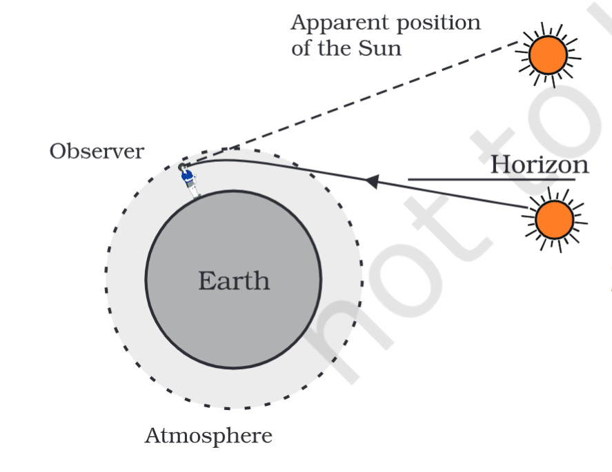

---
Alias:
tags: Study, 10th/Science/Physics/Ch10-Human-Eye
date: August 3, 2023
---
# Definition
It is the refraction caused by the particles of the layers of atmosphere. The refractive index increases as we go near the surface of the earth due to the density of the particles. There are multiple phenomena which work on this principle
## Position of a star
The apparent position of a start is really different than the real position of the star because of the refraction of the starlight by the particles of the atmosphere.

## Twinkling of a star
A star twinkles due to the change in the position of the star and the movement of the particles in the multiple layers of the atmosphere, due to which sometimes the light seems fainter and sometimes brighter.
**The light from the stars are point-sized.**
### Why not planets?
Because planets are much more closer, thus the light coming from the planets have multiple sources, and it nullifies the net effect of twinkling.
## Advance Sunrise and Delayed Sunset
The sun rises 2 minutes earlier and sets 2 minutes later due to the refraction by the atmosphere. It is similar to the position of the star thing.

---
# Backlinks
[[The Human Eye and The Colorful World|Phy Ch10]]

---
# Flashcards

What is atmospheric refraction?
?
It is the refraction caused by the particles of the layers of atmosphere. The refractive index increases as we go near the surface of the earth due to the density of the particles.
<!--SR:!2024-05-09,172,242-->

How does the position of a star gets affected by atmospheric refraction?
?
The apparent position of a start is really different than the real position of the star because of the refraction of the starlight by the particles of the atmosphere.
<!--SR:!2024-03-10,96,222-->

Why does a star twinkle?
?
A star twinkles due to the change in the position of the star and the movement of the particles in the multiple layers of the atmosphere, due to which sometimes the light seems fainter and sometimes brighter.
<!--SR:!2024-09-26,274,262-->

Why does planet not twinkle?
?
Because planets are much more closer, thus the light coming from the planets have multiple sources, and it nullifies the net effect of twinkling.
<!--SR:!2024-03-11,131,260-->

---

%%
Dates: August 3, 2023
%%