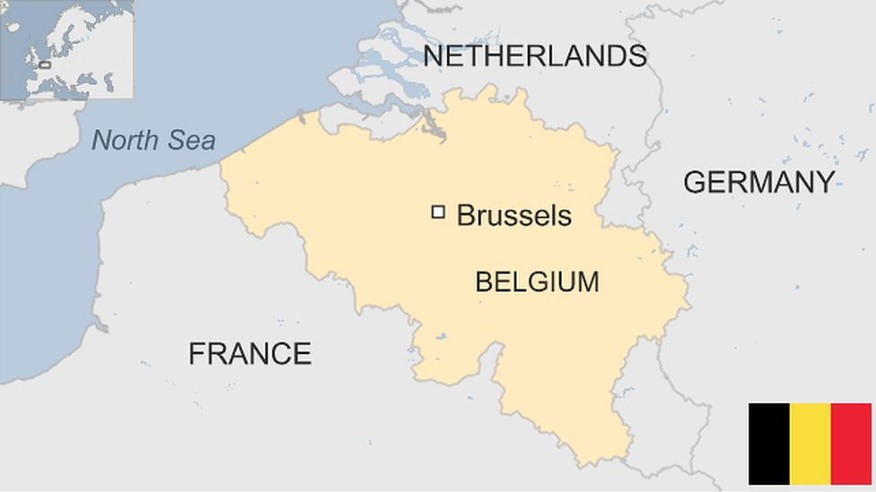

---
Alias:
tags: Study, 10th/SST/Geo/Ch1-Resources-and-Development
date: April 5, 2023
---

# Overview
Belgium is a country in Europe with an area less than the state of Haryana and a population of one crore. ^ac7978

## Map:

# [[Ethnic Composition of Belgium]]

---

# Backlinks

[[Power-Sharing|Civics Ch1]]

[[Geography MOC|Geo]]

---

%%
Dates: April 5, 2023
%%