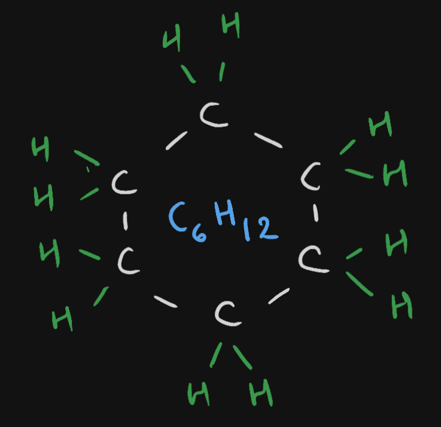
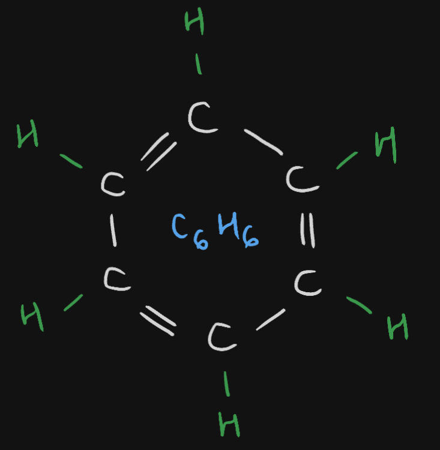

# Definition
Carbon has a tendency to form compounds with itself in the form of branches, chains and rings. This is called Catenation.
## [[Structural Isomers]]
## Cyclic (Aromatic) Compounds
These form rings. Example, cyclohexane ($\ce{C6H12}$); an unsaturated hydrocarbon

## Benzene
The Benzene compound has a formula of $\ce{C6H6}$

---
# Backlinks
[[Carbon's Specialties]]
[[Hydrocarbons]]

---
# Flashcards

What is catenation?
?
Carbon has a tendency to form compounds with itself in the form of branches, chains and rings. This is called Catenation.
<!--SR:!2024-05-23,102,251-->

What are structural isomers?
?
Same compound, same formula, same no. of atoms, but arranged differently.
<!--SR:!2024-06-26,143,285-->

Benzene compound has a formula of {{$\ce{C6H6}$}}
<!--SR:!2024-04-11,94,280-->

Cyclohexane compound has a formula of {{$\ce{C6H12}$}}
<!--SR:!2024-04-23,109,282-->

---

%%
Dates: November 16, 2023
%%