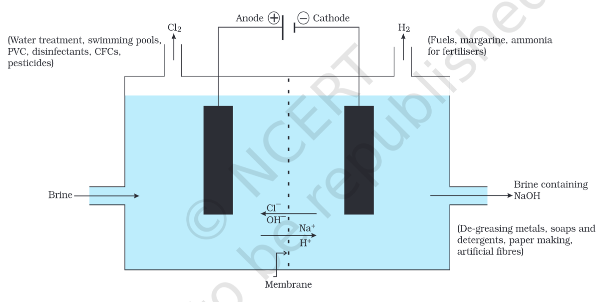

---
Alias:
tags: Study, 10th/Science/Chem/Ch2-Acids-Bases-Salts
date: August 16, 2023
---
# Definition
It is the reaction through which **Brine (soluble $\ce{NaCl}$)** is broken down into $\ce{NaOH}$, $\ce{Cl2}$ and $\ce{H2}$ when electricity is passed through it.

$\ce{2NaCl_{(aq)} + 2H2O_{(l)} -> 2NaOH_{(aq)} + H2_{(g)} + Cl2_{(g)}}$

## Products of Chlor-alkali Process
### Sodium Hydroxide
- De-greasing of metal
- Paper Making
- Soaps, detergents
- Artificial Fibres
### Hydrogen Gas
- In Making $\ce{HCl}$ (with Chlorine gas)
- Used in making margarine and hydrogenation of oil
- In making fertilisers, etc.
### Chlorine Gas
- Used in water treatment
- Used in making PVCs, CFCs, and pesticides
- Used as disinfectant
 
---
# Backlinks
[[Salts]]

---
# Flashcards

What is the chlor-alkali process?
?
It is the reaction through which **Brine (soluble $\ce{NaCl}$)** is broken down into $\ce{NaOH}$, $\ce{Cl2}$ and $\ce{H2}$ when electricity is passed through it.
$\ce{2NaCl_{(aq)} + 2H2O_{(l)} -> 2NaOH_{(aq)} + H2_{(g)} + Cl2_{(g)}}$
<!--SR:!2024-04-05,158,260-->

Chemical Equation for the chlor-alkali process
?
$\ce{2NaCl_{(aq)} + 2H2O_{(l)} -> 2NaOH_{(aq)} + H2_{(g)} + Cl2_{(g)}}$
<!--SR:!2025-01-17,354,260-->

What is brine?
?
NaCl dissolved in water. Soluble NaCl
<!--SR:!2024-05-27,203,280-->

What are the by-products of the chlor-alkali process and what are their uses?
?
### Sodium Hydroxide
- De-greasing of metal
- Paper Making
- Soaps, detergents
- Artificial Fibres
### Hydrogen Gas
- In Making $\ce{HCl}$ (with Chlorine gas)
- Used in making margarine and hydrogenation of oil
- In making fertilisers, etc.
### Chlorine Gas
- Used in water treatment
- Used in making PVCs, CFCs, and pesticides
- Used as disinfectant
<!--SR:!2024-10-22,264,240-->

---

%%
Dates: August 16, 2023
%%