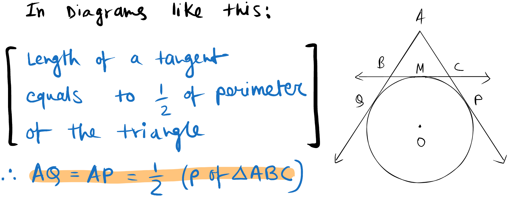
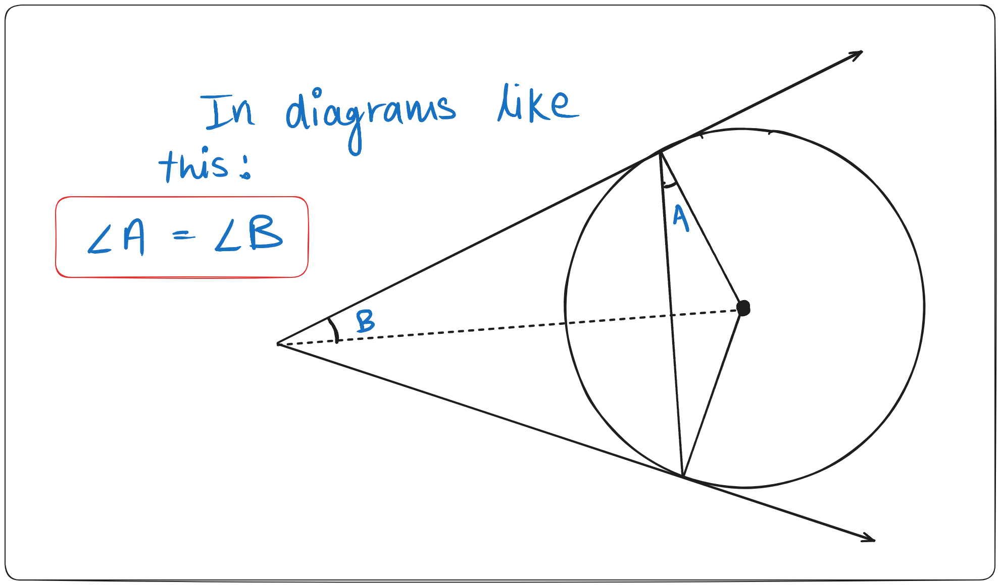

# Concepts
## Theorem 10.1
*Radius is perpendicular to Tangent*

## Theorem 10.2

- *Tangents from the same ext. point are equal*
- *Tangents are equally inclined to the line joining the center and the external point.*
- *The tangents subtend equal angles at the center.*
## Important Note

Also
$$
\text{Tangent} = \frac{\text{Radius} \times \frac{1}{2}\text{Chord}}{\text{Distance between Center and Chord}}
$$
# Assignments
Circle DHA

---
# Backlinks
[[Math MOC|Maths]]

---
# Flashcards

---

%%
Dates: October 11, 2023
%%