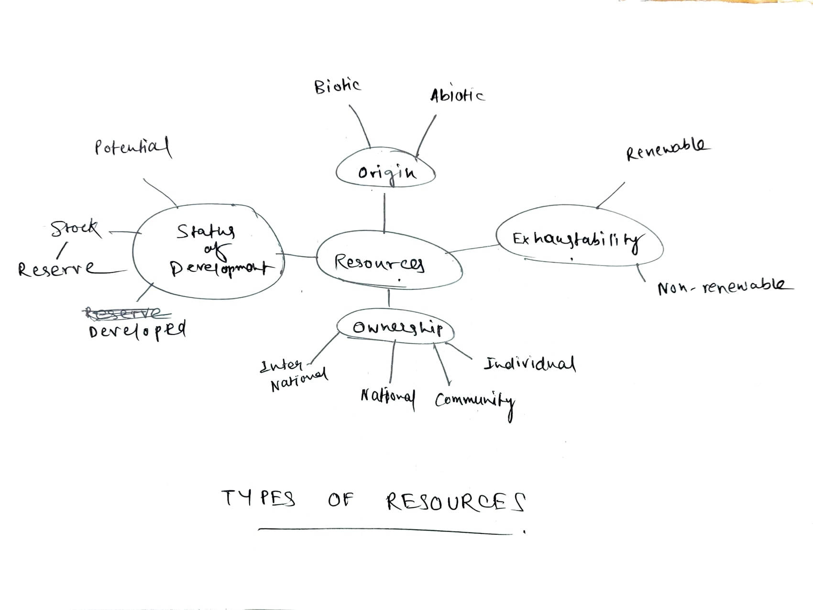

# Definition

We can classify [[Resource|Resources]] in 4 types:
## On the basis of Origin
This means the source where the resource is obtained from.
### Biotic Resource
Biotic Resources are obtained from nature.
- Examples of biotic - Livestock, forests, humans.
### Abiotic Resource
These are composed of non-living things
- Examples of abiotic - rocks and minerals.

## On the basis of exhaustibility.
Whether the resource can get finished or not.

These are divided into:
### [[Renewable Resource]]
### [[Non-Renewable Resource]]
## On the basis of Ownership
### Private / Individual
Yes, it is private property, not shared.
For example, homes, cars, etc.
### Community
Which are shared and maintained by the community
For example, marketplace, shops?
### National
Well, sanctuaries, lands, which are national property.
also 12 nautical miles of sea
### International
Beyond national sea limits, space, etc.
## On the basis of Development
### Potential Resource
Which has the potential to be used as a resource, but in the future.
For example, students.
### Developed Resource
Which are developed and are in use.
For example, teachers or the productive workforce.
### Stock Resource
These are the resources which are potential but cannot be used due to limitations in technology, research, etc.
#### Reserved Resources
They are the resources which are not yet used. (Like Potential)

---

# Backlinks

[[Resources and Development]]

---

%%
Dates: April 4, 2023, April 7, 2023, June 19, 2023
%%