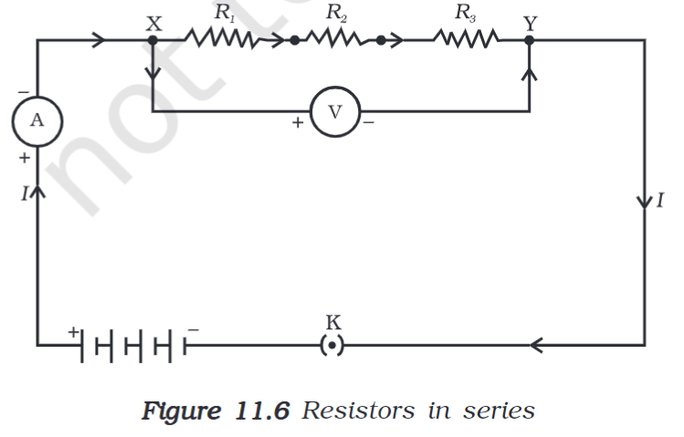
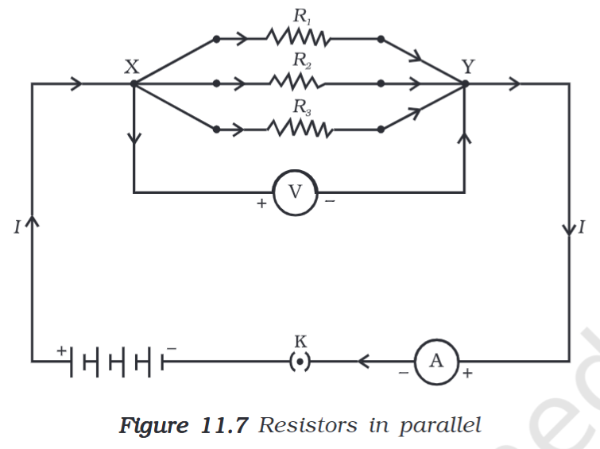

---
aliases:
tags:
  - Study
  - 10th/Science/Physics/Ch11-Electricity
date: September 9, 2023
---
# Definition
There can be two combinations of resistors in a circuit as per appropriate needs.
**Why?** Because often times, there is only one source of [[Potential Difference]] and multiple appliances require different current, voltage, etc.
To counter that, resistors are used to manipulate such parameters.
## Series Connection
In this circuit, the resistors are put one by one in the same wire,
Thus, the resistance is added up.
- **In this connection, the voltage changes, but current stays the same**

### Equivalent Resistance
Since, voltages are different,
$$
V = V_{1}+ V_{2}+ V_3
$$
Now, by [[Ohm's Law]],
$$
IR_{p}= IR_{1}+IR_{2}+IR_{3}
$$
Since, the current stays the same:
$$
R_{p}= R_{1}+ R_{2}+ R_{3} 
$$

## Parallel Connection
In this circuit, the resistors are put parallelly to each other. The reciprocal of the equivalent resistance is the sum of the reciprocals of the resistors.
- **In this connection, voltage stays the same, but current is different**

### Equivalent Resistance
Since, currents are different,
$$
I = I_{1}+ I_1+I_3
$$
By [[Ohm's Law]],
$$
\frac{V}{R} = \frac{V}{R_{1}}+ \frac{V}{R_{2}} + \frac{V}{R_{3}}
$$
Since voltages are the same:
$$
\frac{1}{R}= \frac{1}{R_{1}} + \frac{1}{R_{2}} + \frac{1}{R_{3}}
$$
## Voltmeter and Ammeter
Voltmeter is to measure the potential difference **across two points**. It has a high resistance, and thus placed parallelly in a circuit. Because the resistance is so high, the current that passes through it is minute compared to the current flowing across the two points.
What happens if you put it in a series? It would display the potential flowing through it, which would be zero, since the resistance is so high.

Ammeter is to measure the current in the circuit. It has a low resistance, thus can be placed in series.

---
# Backlinks
[[Resistance]]
[[Electricity]]

---
# Flashcards

What is the series connection and formula for equivalent resistance?
?
In this circuit, the resistors are put one by one in the same wire,
- **In this connection, the voltage changes, but current stays the same**
$
R_{p}= R_{1}+ R_{2}+ R_{3}
$
<!--SR:!2024-05-09,145,280-->

What is the parallel connection and formula for equivalent resistance?
?
In this circuit, the resistors are put parallelly to each other. The reciprocal of the equivalent resistance is the sum of the reciprocals of the resistors.
- **In this connection, voltage stays the same, but current is different**
$
\frac{1}{R}= \frac{1}{R_{1}} + \frac{1}{R_{2}} + \frac{1}{R_{3}}
$
<!--SR:!2024-04-01,118,287-->

In {{Series}} connection, the {{voltage changes, but current stays the same}}
<!--SR:!2024-12-13,297,280!2024-04-29,126,287-->

In {{Parallel}} connection, the {{voltage stays the same, but current is different}}
<!--SR:!2024-04-14,111,260!2024-04-23,120,267-->

What is a voltmeter and how is it placed in a circuit?
?
Voltmeter is to measure the potential difference across two points. It has a high resistance, and thus placed parallelly in a circuit.
<!--SR:!2024-10-24,265,280-->

What is an ammeter and how is it placed in a circuit?
?
Ammeter is to measure the current in the circuit. It has a low resistance, thus can be placed in series.
<!--SR:!2024-05-14,131,267-->

---

%%
Dates: September 9, 2023
%%