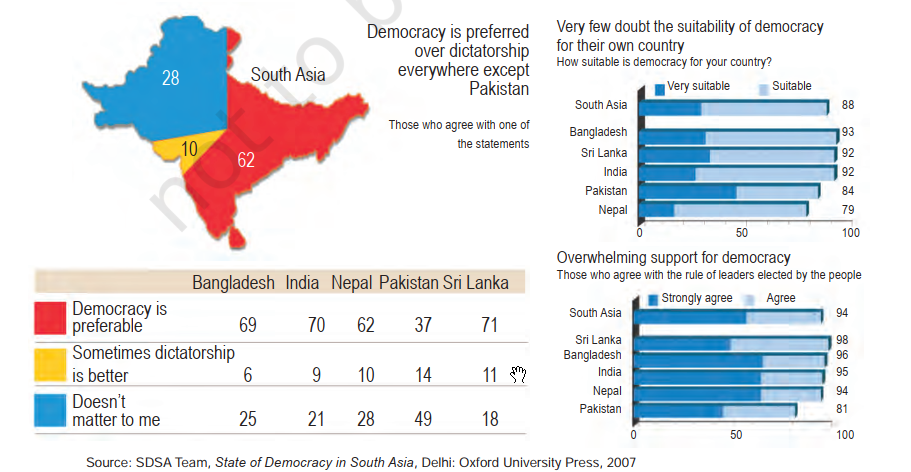

# [[Civics MOC|Civics]]
## [[Power-Sharing]]
Belgium:

Sri Lanka:

## [[Federalism]]
Hindi is the mother tongue of 40% of the people.
## [[Gender, Religion and Caste]]
- The literacy rate among women is only 54 per cent compared with 76 per cent among men.
- Such sex-selective abortion led to a decline in child sex ratio (number of girl children per thousand boys) in the country to merely 919. Ratio has fallen below 850 or even 800 in some States.
- For example, the percentage of elected women members in Lok Sabha has touched 14.36 per cent of its total strength for the first time in 2019.
- 
- 
## [[Political Parties]]
- More than 750 parties are registered with the Election Commission of India.
- For example, in India there were three such major alliances in 2004 parliamentary elections– the National Democratic Alliance, the United Progressive Alliance and the Left Front.
- 
- A party that secures at least **six per cent** of the total votes in an election to the Legislative Assembly of a State and wins **at least two seats** is recognised as a **State party**. 
- A party that secures at least **six per cent** of the total votes in Lok Sabha elections or Assembly elections in four States and wins **at least four seats** in the Lok Sabha is recognised as a **national party**
## [[Outcomes of Democracy]]
- 
- 
- 
- 
# [[Economics MOC|Eco]]
## [[Development]]
- Countries with per capita income of US$ 49,300 per annum and above in 2019, are called high income or rich countries and those with per capita income of US$ 2500 or less are called low-income countries. India comes in the category of low middle income countries because its per capita income in 2019 was just US$ 6700 per annum.
- 
- 
- 
## [[Sectors of Indian Economy]]
- The employment figures are based on data taken from the five-yearly surveys on employment and unemployment conducted by the National Sample Survey Organisation (NSSO) now known as National Statistical Office (NSO).
- 
- 
- 
## [[Money and Credit]]
- banks in India these days hold about 15 per cent of their deposits as cash.
- 
- 
## [[Globalisation and the Indian Economy]]
- Starting around 1991, some farreaching changes in policy were made in India for Liberalisation
- Industries were just coming up in the 1950s and 1960s
- About 160 countries of the world are currently members of the WTO

---
%%
Dates: January 29, 2024
%%
