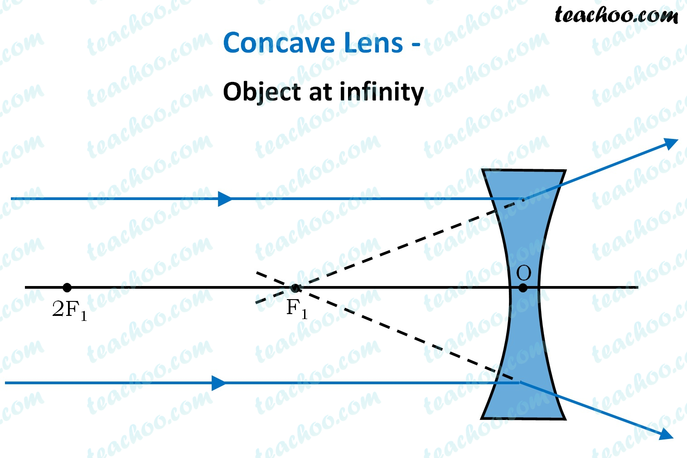
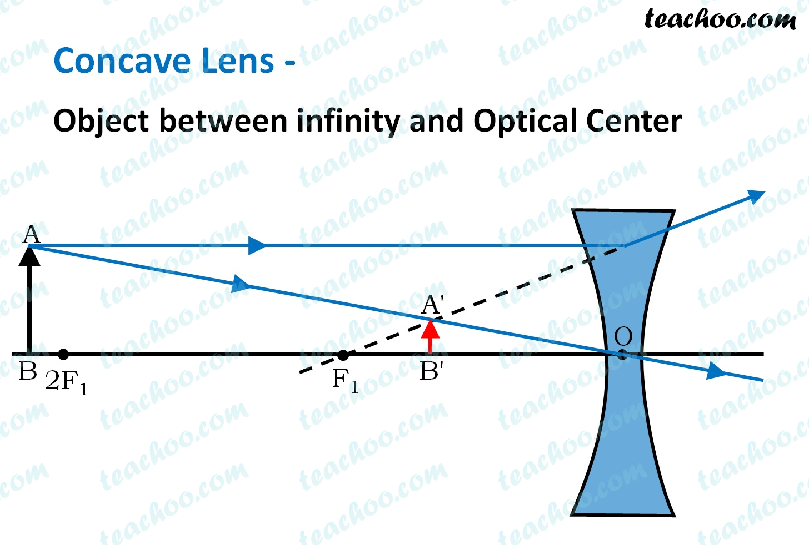

---
Alias:
tags: Study, 10th/Science/Physics/Ch9-Light
date: July 7, 2023
---
# Definition
A concave lens is bounded by two spherical surfaces curved inwards. It **diverges** rays of light.
## Image formation
### Ray diagrams

Inference: **Focus is in the left side of the lens**

|Object Position|Image Position|Nature|Size|
|---|---|---|---|
|Infinity|Focus (object side)|VE|Point sized|
|Between Infinity and Pole|B/w P and F (object side)|VE|Diminished|

---
# Backlinks
[[Spherical Lenses]]

---
# Flashcards

What are concave lens?
?
A concave lens is bounded by two spherical surfaces curved inwards. It **diverges** rays of light.
<!--SR:!2025-06-13,509,282-->

Which lens is called diverging lens?;;Concave Lens
<!--SR:!2025-05-24,494,280-->

Focus is in the left side of the lens in {{concave lenses}}.
<!--SR:!2025-06-25,520,282-->

---

%%
Dates: July 7, 2023
%%