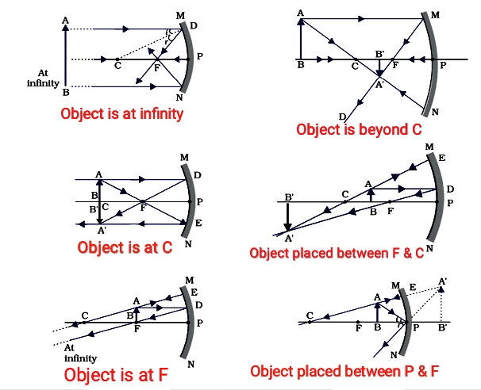

---
Alias:
tags: Study, 10th/Science/Physics/Ch9-Light
date: July 5, 2023
---
# Definition
A concave mirror's reflective surface is curved inwards, meaning it **converges** rays of light.
## Properties of concave mirror
- It always forms a real and inverted image in all cases **except when object is between focus and pole.**
- It converges light.
- The focus is on the side of the object.
## Image formation
It follows the [[Rules of Image formation by Spherical Mirrors]].
### Ray Diagrams

From this we can infer that,

|Object Position|Image Position|Nature|Size|
|---|---|---|---|
|Infinity|Focus|RI|Point sized|
|Beyond C|B/w C and F|RI|Diminished|
|C|C|RI|Same Size|
|b/w C and F|Beyond C|RI|Enlarged|
|Focus|Infinity|RI|Highly Enlarged|
|b/w P and F|Behind the mirror|VE|Enlarged|

We can establish the relation between the object position and the image position as:
**54321
12345**
## Uses of concave mirrors
- Torches
- Vehicle headlights
- Shaving mirrors
- Dentist's mirror
- Large Concave is used in solar furnaces to concentrate heat.

---
# Backlinks
[[Spherical Mirrors]]

---
# Flashcards

Which mirror converges light?;;Concave Mirror
<!--SR:!2025-08-20,568,300-->

Write some uses of concave mirror.
?
- Torches
- Vehicle headlights
- Shaving mirrors
- Dentist's mirror
- Large Concave is used in solar furnaces to concentrate heat.
<!--SR:!2024-10-20,256,244-->

Object pos-image pos relation in concave mirrors?
?
**54321
12345
<!--SR:!2024-04-09,202,263-->

---

%%
Dates: July 5, 2023
%%