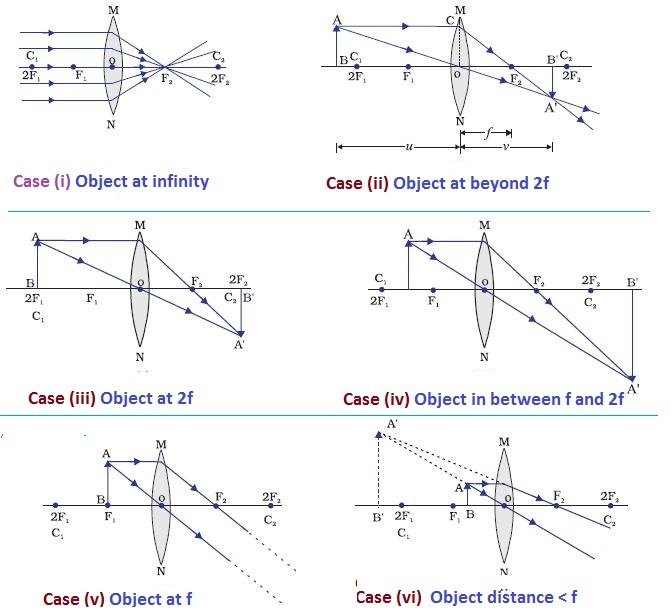

---
Alias:
tags: Study, 10th/Science/Physics/Ch9-Light
date: July 7, 2023
---
# Definition
A lens which has two spherical surfaces bulging outwards is called a convex lens. It **converges** rays of light. It is thicker in the middle.
## Image formation
### Ray Diagrams

From this we can infer that:

|Object Position|Image Position|Nature|Size|
|---|---|---|---|
|Infinity|Focus|RI|Point sized|
|Beyond 2F|B/w 2F and F|RI|Diminished|
|2F|2F|RI|Same Size|
|b/w 2F and F|Beyond 2F|RI|Enlarged|
|Focus|Infinity|RI|Highly Enlarged|
|b/w P and F|Behind the object|VE|Enlarged|

---
# Backlinks
[[Spherical Lenses]]

---
# Flashcards

What are convex lenses?;;A lens which has two spherical surfaces bulging outwards is called a convex lens. It **converges** rays of light. It is thicker in the middle.
<!--SR:!2025-07-21,538,280-->

Which lens is called as converging lens?;;Convex Lens
<!--SR:!2024-04-08,201,262-->

---

%%
Dates: July 7, 2023
%%