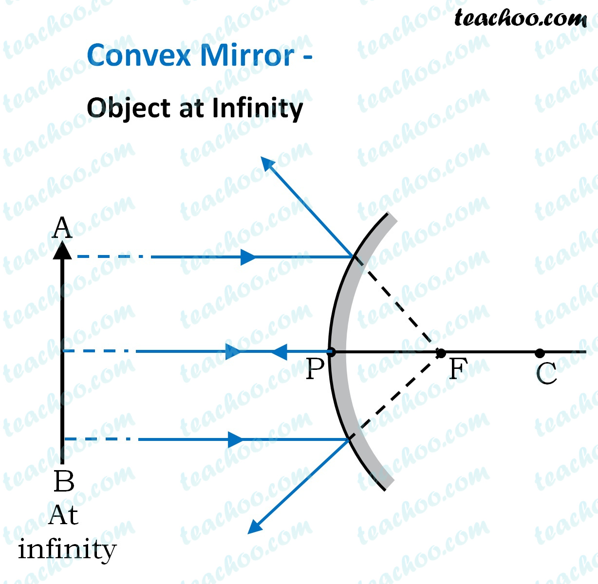
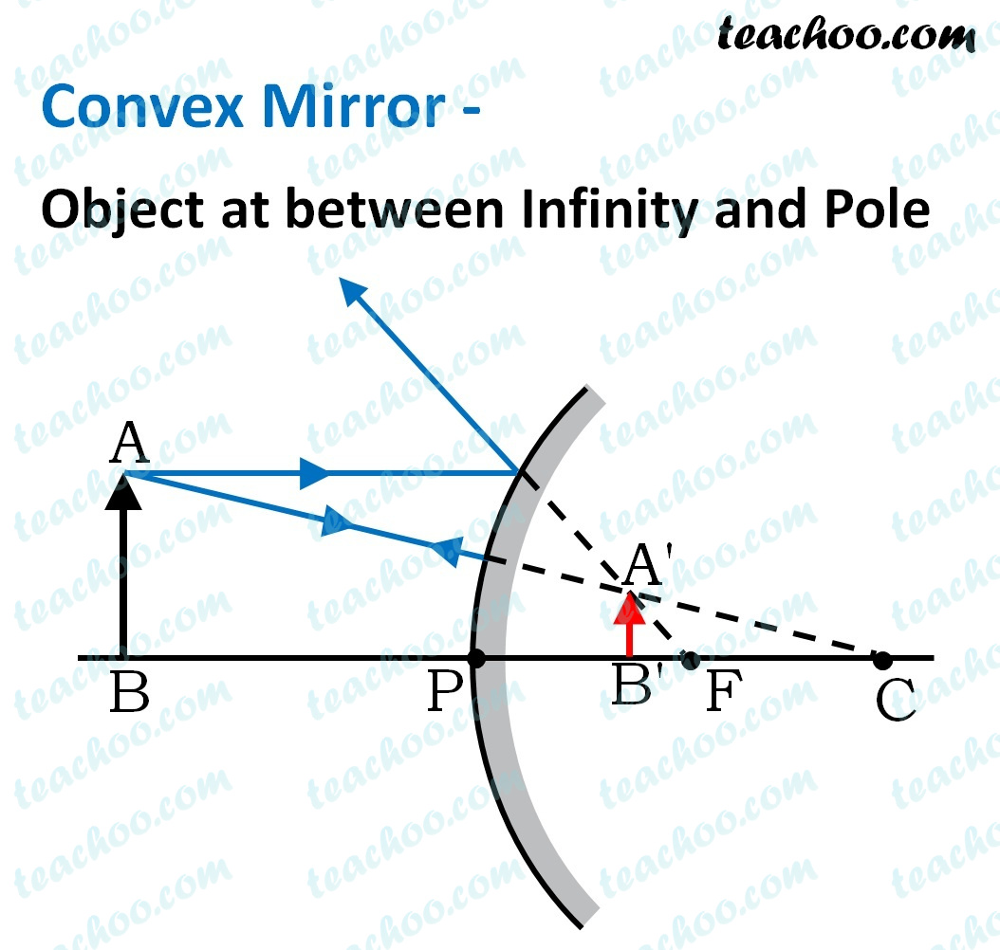

---
Alias:
tags: Study, 10th/Science/Physics/Ch9-Light
date: July 6, 2023
---
# Definition
The reflective is curved outwards, thus it **divereges** light. It always forms a **virtual image.**
## Image Formation
It also follows the [[Rules of Image formation by Spherical Mirrors]]
### Ray Diagrams

Thus, it has only two diagrams. 
From this, we can infer that,

|Object Position|Image Position|Nature|Size|
|---|---|---|---|
|Infinity|Focus|VE|Point sized|
|Between Infinity and Pole|B/w P and F|VE|Diminished|
## Uses of convex mirrors
It has a wider FOV, thus is used for rear-view wing mirrors.
It can be used to see full length images of buildings, etc.

---
# Backlinks
[[Spherical Mirrors]]

---
# Flashcards

Which mirror diverges light?;;Convex Mirror
<!--SR:!2024-03-22,159,280-->

Why are convex mirrors used as rear view mirrors?;;Because of wide FOV
<!--SR:!2024-04-15,208,280-->

Which mirror is used for obtaining full-length images of a tall building?;;Convex Mirror
<!--SR:!2024-10-07,278,229-->

---

%%
Dates: July 6, 2023
%%