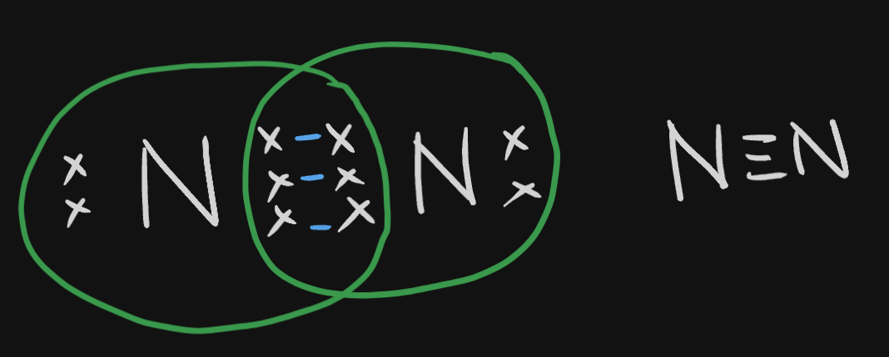

# Definition
They **share** electrons, and neither give nor take them.
So better we both share the things that we need.
## Single Covalent Bond

In dot structure, it is represented like in the left side, the right side is the Lewis Structure, which is much simplified.
## Double Covalent Bond

In a dot electron structure, the valence electrons are displayed. Bonds are made based on the electrons they need to share in order to get it.
**Each bond is represented by a dash in Lewis Structure.**
## Triple Covalent Bond

## Tetravalency
Carbon, and other similar elements possess a property of tetravalency, meaning, they have 4 valence electrons and share electrons.
**Why?**
- Giving away 4 electrons introduces instability between protons and elections.
- Taking 4 elections also introduces instability between protons and elections.
## Characteristics of Covalent Compounds
Antithesis of [[Ionic Compounds]]
- They have weak bonds
- They have low melting and boiling points
- They are insoluble in water and soluble in benzene, petrol, kerosene, etc.
- They do not conduct electricity (because they do not produce free ions.)

---
# Backlinks
[[Carbon and Its Compounds|Chem Ch4]]

---
# Flashcards

What is a covalent bond?
?
They **share** electrons, and neither give nor take them.
<!--SR:!2024-05-19,110,284-->

What is tetravalency?
?
Carbon, and other similar elements possess a property of tetravalency, meaning, they have 4 valence electrons and share electrons.
<!--SR:!2024-03-23,70,260-->

What are the properties of covalent compounds?
?
- They have weak bonds
- They have low melting and boiling points
- They are insoluble in water and soluble in benzene, petrol, kerosene, etc.
- They do not conduct electricity (because they do not produce free ions.)
<!--SR:!2024-03-30,77,260-->

---

%%
Dates: November 15, 2023
%%