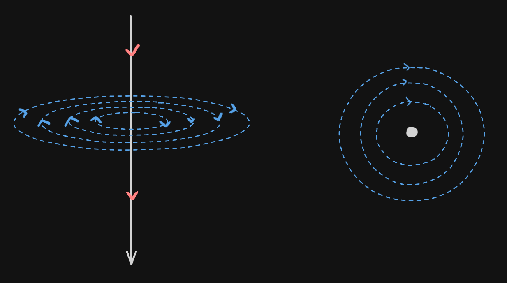
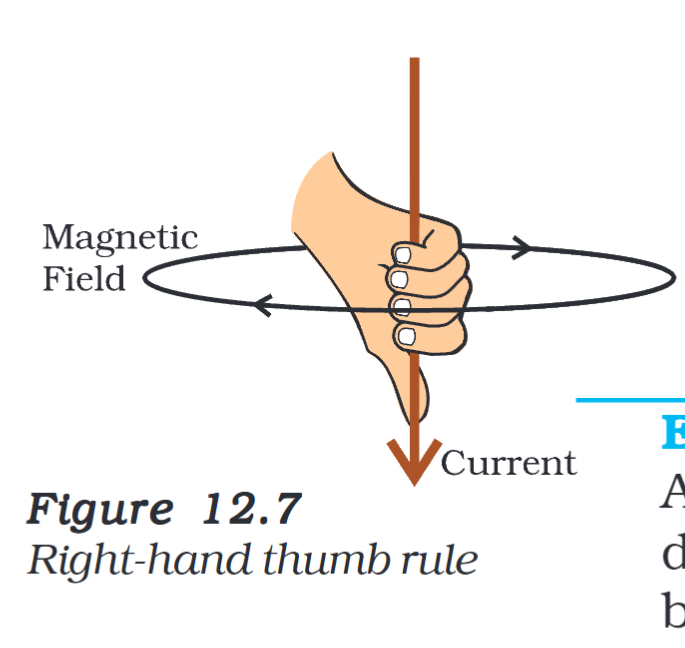
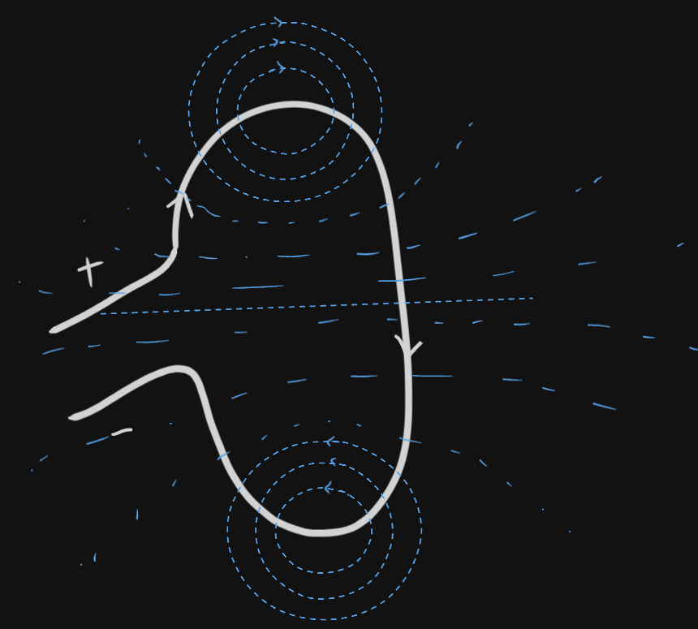
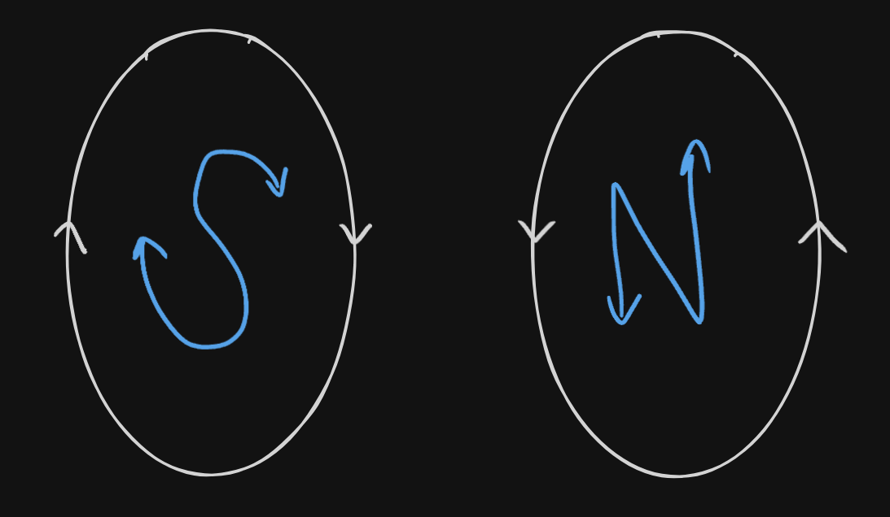
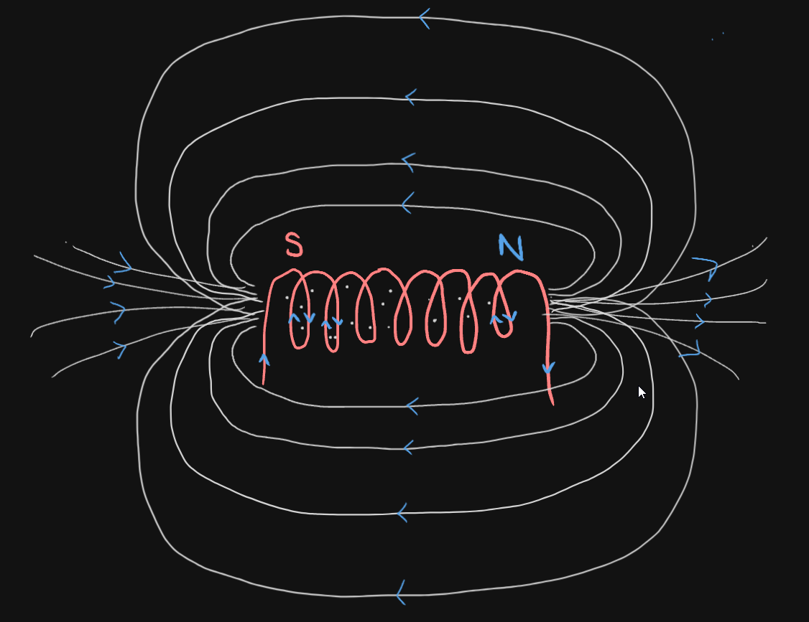
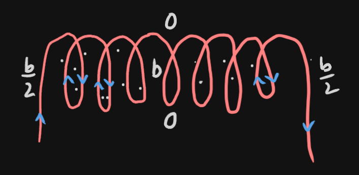

# Definition
## Straight CCC

we can see that a straight CCC forms a M.F. in the form of concentric circle where the centre is the conductor.
### Right Hand Thumb Rule
This rule is used to find the direction of current or the direction of magnetic field of a #Straight CCC. 

## Circular Loop 
The circular loop forms M.F like this

It makes a straight line in the middle. And it makes two different poles in two different sides (like two sides of the same coin)
### Connection between Direction of current and Polar Face

## Solenoid
A solenoid is a coil made of circular loops which has a magnetic field similar to that of a bar magnet. 

### Points to be noted
- M.F is the same inside all the points of a solenoid.
- A soft iron (Fe) can be used as a core to convert it into a electromagnet.
- 

---
# Backlinks
[[Magnetic Effect of Electric Current]]

---
# Flashcards

What is the Right Hand Thumb Rule?
?
This rule is used to find the direction of current or the direction of magnetic field of a #Straight CCC.
<!--SR:!2024-04-07,94,280--> 

A straight CCC forms a M.F. in the form of {{concentric circle}}
<!--SR:!2024-07-11,154,291-->

What is a solenoid
?
A solenoid is a coil made of circular loops which has a magnetic field similar to that of a bar magnet.
<!--SR:!2024-04-03,94,282--> 

---

%%
Dates: November 8, 2023
%%