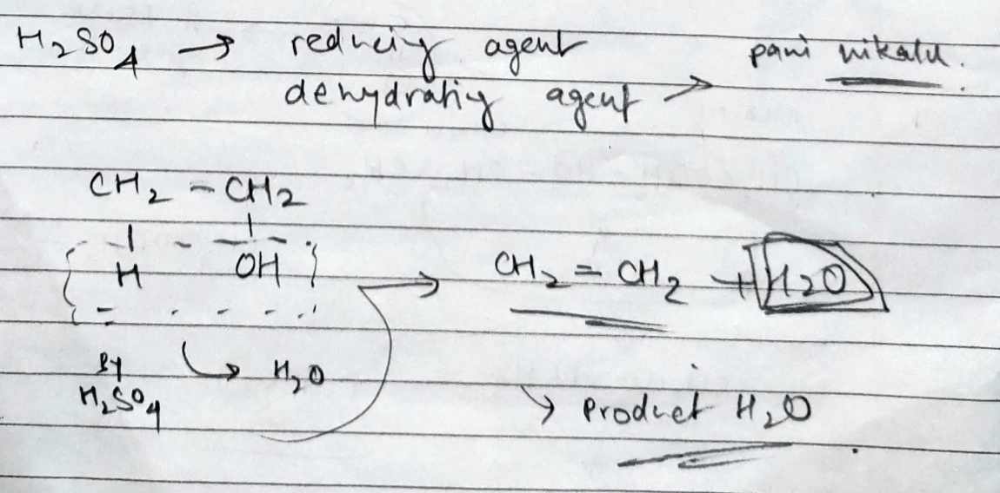

# Definition
Dehydrating agents take out water from the reactant(s). Common example is $\ce{H2SO4}$. Which is a good reducer and takes out $\ce{H2O}$ from everything.

with reference to Alcohol to unsaturated hydrocarbon

---
# Backlinks
[[Chemistry MOC|Chem]]

---

%%
Dates: November 26, 2023
%%