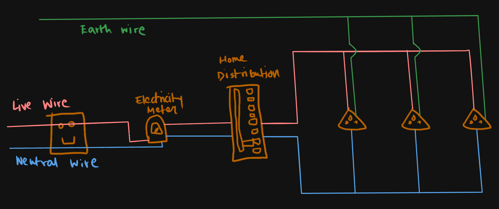

# Definition
## Circuit Board in our houses
220V electricity comes into our houses from the electricity board. The circuitry in our houses are made in this way:

The earth wire is important because it leads the excess amount of electricity to the ground via a low resistance path so that people don't shock themselves.
## Short Circuit and overloading
When Live wire and the Neutral wire touch and suddenly there is a spike in the voltage, this causes an overloading and it is called a short circuit.
Overloading can also be caused by plugging in too many appliances in one socket.
### Fuse
To prevent overloading, fuses are used, which by [[Heating Effect of Electric Current|Joule's heating]], melt after a certain threshold of current and stop the flow of electricity. These are rated in different amounts, like 2A, 5A, etc.

---
# Backlinks
[[Magnetic Effect of Electric Current]]

---
# Flashcards

What is a fuse?
?
To prevent overloading, fuses are used, which by [[Heating Effect of Electric Current|Joule's heating]], melt after a certain threshold of current and stop the flow of electricity. These are rated in different amounts, like 2A, 5A, etc.
<!--SR:!2024-06-17,136,284-->

What is a short circuit?
?
When Live wire and the Neutral wire touch and suddenly there is a spike in the voltage, this causes an overloading and it is called a short circuit.
Overloading can also be caused by plugging in too many appliances in one socket.
<!--SR:!2024-06-23,141,260-->

Why is the earth wire important?
?
The earth wire is important because it leads the excess amount of electricity to the ground via a low resistance path so that people don't shock themselves.
<!--SR:!2024-03-29,87,260-->

---

%%
Dates: November 11, 2023
%%