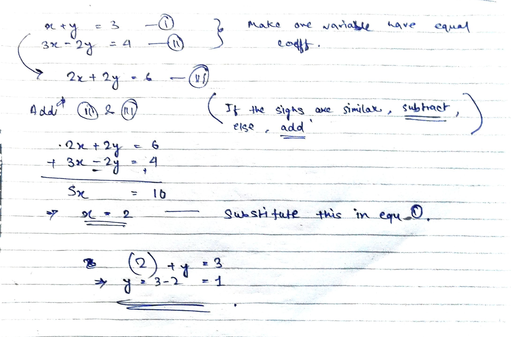

---
Alias:
tags: Study, 10th/Maths/Ch3-Pair-of-Linear-E
date: June 4, 2023
---
# Definition
Let's take an example,

## Make sure to ADD if the signs are different, and SUBTRACT if signs are similar.

---
# Backlinks
[[Algebraic Method of solving pair of linear equations]]

---
# Flashcards

---

%%
Dates: June 4, 2023
%%