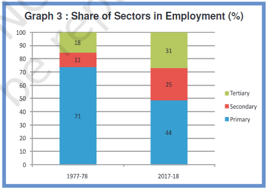
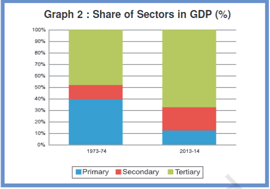

---
Alias:
tags: Study, 10th/SST/Eco/Ch2-Sectors-of-Indian-Eco
date: August 17, 2023
---
# Definition
## Shares

Most of the jobs are created by the Primary Sector. But as we can see from the graph below that most of the share in the GDP is held by the Tertiary Sector.

**Why?** Because jobs are not created enough in the Tertiary and Secondary Sectors, which force people to search for work in the Primary Sector. Yet the Primary Sector does not have a share in the GDP as compared to Secondary or Tertiary Sector
## Underemployment
This means that the work has more people than necessary. Like in the Primary Sector, This is also called **Disguised Unemployment**.
For example, working on a farm needs 2 people for fulfilment, but 5 people are working on it. Meaning that 3 people are **underworked.**

This may happen in other sectors too. Like the casual workers in urban areas who search for work everyday.
## Creating more employment
This is the responsibility of the government (and the people).
Things that can be done are:
- Making of canals and dams for irrigation of land.
- Offering loans at cheap interest rates via banks.
- Investing in transportation and storage of crops
- Promoting local industries, preferably in semi-rural areas to employ large number of people.
- Creating jobs in education sector (~20L jobs).
- Improving tourism as a sector (~35L jobs).

The Planning Commission (NITI Aayog) does the planning and implementation.
### Right to Work
Many things require a long time to implement, so for the short term solution, the government implemented **Mahatma Gandhi National Rural Employment Guarantee Act (MGNREGA 2005)** for Right to Work.
This grants:
- 100 Days of work every year to those who are in need.
- Allowance if government fails to provide employment.

---
# Backlinks
[[Comparison of Sectors]]

---
# Flashcards

Why does primary sector have more share in employment but less share in GDP??
?
Because jobs are not created enough in the Tertiary and Secondary Sectors, which force people to search for work in the Primary Sector. Yet the Primary Sector does not have a share in the GDP as compared to Secondary or Tertiary Sector
<!--SR:!2024-03-27,74,200-->

What is underemployment?
?
This means that the work has more people than necessary. Like in the Primary Sector, This is also called **Disguised Unemployment**.
For example, working on a farm needs 2 people for fulfilment, but 5 people are working on it. Meaning that 3 people are **underworked.**
<!--SR:!2024-03-15,130,240-->

How to create more employment?
?
Things that can be done are:
- Making of canals and dams for irrigation of land.
- Offering loans at cheap interest rates via banks.
- Investing in transportation and storage of crops
- Promoting local industries, preferably in semi-rural areas to employ large number of people.
- Creating jobs in education sector (~20L jobs).
- Improving tourism as a sector (~35L jobs).
- MGNREGA 2005
	- 100 Days of work, and allowance if failed.
<!--SR:!2024-05-14,78,240-->

What is MGNREGA?
?
Many things require a long time to implement, so for the short term solution, the government implemented **Mahatma Gandhi National Rural Employment Guarantee Act (MGNREGA 2005)** for Right to Work.
This grants:
- 100 Days of work every year to those who are in need.
- Allowance if government fails to provide employment.
<!--SR:!2024-07-09,232,280-->

The {{Planning Commission (NITI Aayog)}} does the planning and implementation.
<!--SR:!2024-05-06,173,260-->

---

%%
Dates: August 17, 2023
%%