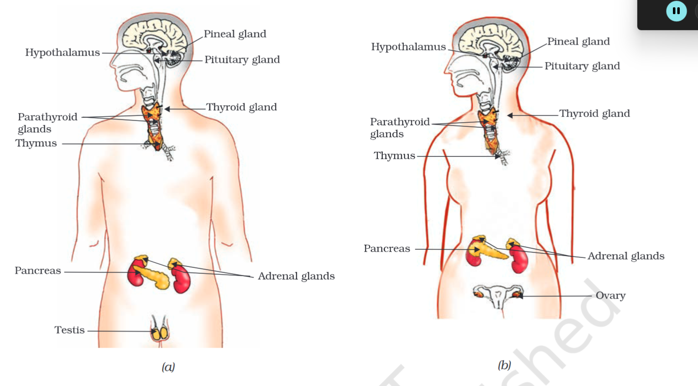

---
Alias:
tags: Study, 10th/Science/Bio/Ch6-Control-and-Coordination
date: August 27, 2023
---
# Definition
Since [[Nervous System]] is restricted to the neurons and the cells near it, using chemical signals, information can be transmitted to all cells of the body.
The endocrine glands release hormones in the blood so that it reaches all the parts of the body

## Hormones in Animals
| Gland        | Hormone                                  | Location                             | Function                                                                                |
| ------------ | ---------------------------------------- | ------------------------------------ | --------------------------------------------------------------------------------------- |
| Adrenal      | Adrenaline                               | Above the Kidney                     | Trigger flight-or-fight response                                                        |
| Thyroid      | Thyroxine                                | Neck/Throat                          | Controls metabolism                                                                     |
| Hypothalamus | Releasing Hormone and Inhibiting Hormone | Forebrain | Regulates the Pituitary Gland                                                           |
| Pituitary   | Growth Hormone                           | Forebrain | Master Gland of the body, controls the other organs and growth (Dwarfism and Gigantism) |
| Pancreas     | Insulin                                  | Abdomen                              | Regulates Blood Glucose levels                                                          |
| Testis       | Testosterone                             | Genital/Lower Abdomen                | Development of male reproductive organs and secondary sexual characters                 |
| Ovaries      | Estrogen                                 | Genital/Lower Abdomen                | Development of female reproductive organs and secondary sexual characters                 |

^87ed0e

^37ac00
## Feedback Mechanism
It is the process through which there is a timely delivery of the hormones and in required quantities according to the needs.

---
# Backlinks
[[Control and Coordination|Bio Ch6]]

---
# Flashcards

What is the endocrine system?
?
Since [[Nervous System]] is restricted to the neurons and the cells near it, using chemical signals, information can be transmitted to all cells of the body.
The endocrine glands release hormones in the blood so that it reaches all the parts of the body
<!--SR:!2024-04-20,122,220-->

What are some hormones in animals?
?

<!--SR:!2024-10-15,273,260-->

What is the feedback mechanism?
?
It is the process through which there is a timely delivery of the hormones and in required quantities according to the needs.
<!--SR:!2024-09-02,246,264-->

---

%%
Dates: August 27, 2023
%%