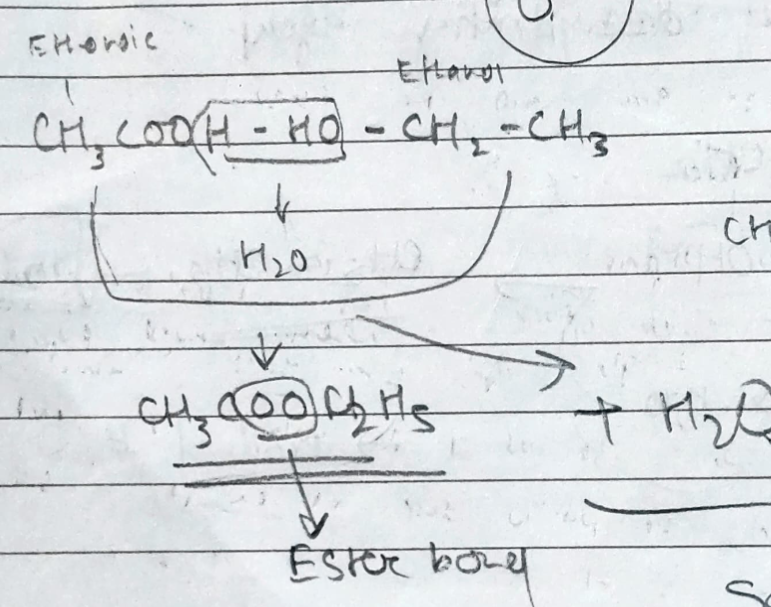

# Definition
One of the most important reaction in food processing. The ester bond ($\ce{O-C=O}$) produces a fruity smell.
It is produced by reacting a carboxylic acid with an alcohol under the presence of an acid.

---
# Backlinks
[[Carboxylic Acid]]

---
# Flashcards

What is esterification?
?
$$
\ce{CH3CH2OH + CH3COOH \xrightarrow{\text{Acid }{(\ce{H2SO4})}} \underset{\text{Ethyl Ethanoate}}{CH3COOC2H5} + H2O}
$$
<!--SR:!2024-05-25,126,280-->

---

%%
Dates: November 26, 2023
%%