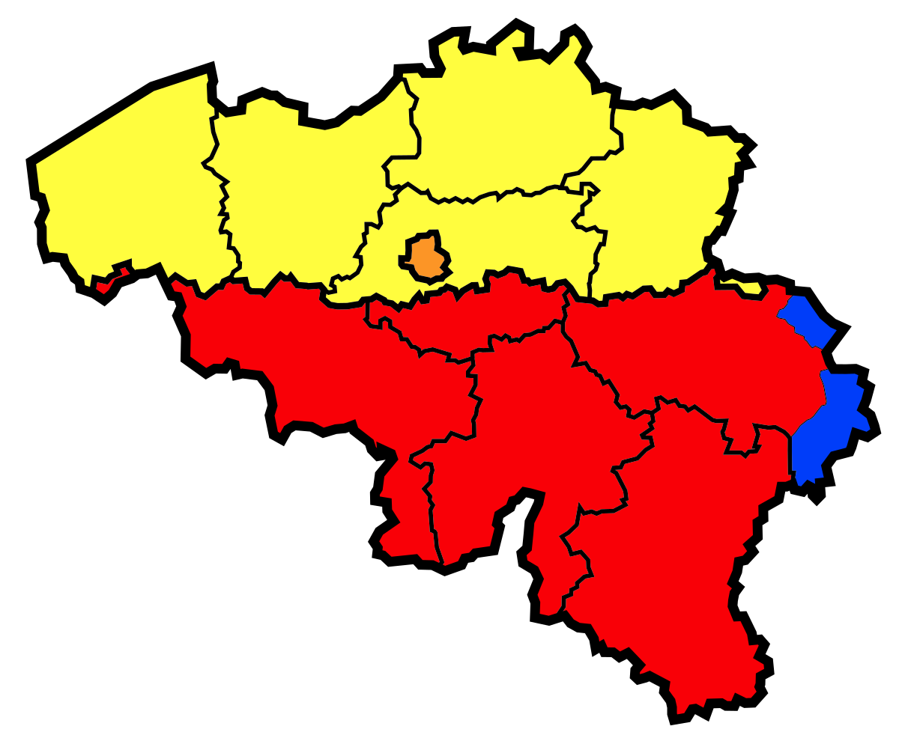

---
Alias:
tags: Study, 10th/SST/Civics/Ch1-Power-Sharing
date: April 5, 2023
---
# Definition
The ethnic composition of [[Belgium]] is really complex.

## Composition
- 59% of the people live in Dutch-speaking **Flemish** region.
- 40% of the people live in the French-speaking **Walloon** region.
- 1% of the people live in German speaking region.

### In Brussels
- 80% of the people speak French.
- 20% of the people speak Dutch.

## Map

🟨- Flemish Region (Dutch)
🟧- Brussels - Capital
🟥- Walloon Region (French)
🟦- German Speaking

---

# Backlinks

[[Belgium and Sri Lanka]]

---
# Flashcards

Dutch people lived in the {{Flemish}} region
<!--SR:!2024-06-02,232,280-->

French people lived in the {{Walloon}} region
<!--SR:!2024-06-06,236,280-->

Ethnic Composition of Belgium?
?
- 59% of the people live in Dutch-speaking **Flemish** region.
- 40% of the people live in the French-speaking **Walloon** region.
- 1% of the people live in German speaking region.
<!--SR:!2024-06-25,206,220-->

Ethnic Composition in the Capital of Belgium?
?
- 80% of the people speak French.
- 20% of the people speak Dutch.
<!--SR:!2024-06-29,149,240-->

Label the regions on Belgium

?
🟨- Flemish Region (Dutch)
🟧- Brussels - Capital
🟥- Walloon Region (French)
🟦- German Speaking
<!--SR:!2024-03-26,185,264-->

---
%%
Dates: April 5, 2023
%%