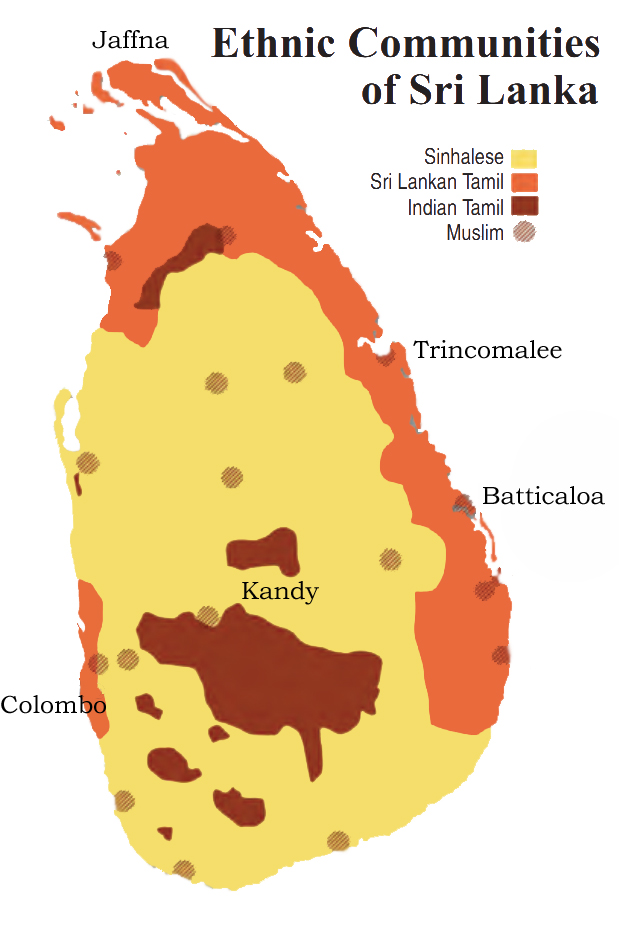

---
Alias:
tags: Study, 10th/SST/Civics/Ch1-Power-Sharing
date: April 5, 2023
---

# Definition
The population of [[Sri Lanka]] is also pretty diverse.

## Composition
- Sinhala Speakers (74%)
- Tamil Speakers (18%)
	- Sri Lankan Tamils (13%)
	- Indian Tamils (5%)

Most of the Sinhala speakers are Buddhists, while Tamil speakers are mostly Hindu or Muslims. There are about 7% of Christians who are both Tamil and Sinhala.

## Map:

---

# Backlinks

[[Belgium and Sri Lanka]]

---
# Flashcards

Ethnic composition of Sri-Lanka?
?
- Sinhala Speakers (74%)
- Tamil Speakers (18%)
	- Sri Lankan Tamils (13%)
	- Indian Tamils (5%)
<!--SR:!2024-03-30,131,240-->

Most of the Sinhala speakers are {{Buddhists}}, while Tamil speakers are mostly {{Hindu or Muslims}}.
<!--SR:!2024-10-24,241,260!2024-05-03,124,240-->

There are about {{7%}} of Christians who are both Tamil and Sinhala in Sri-Lanka.
<!--SR:!2025-03-23,418,260-->

---
%%
Dates: April 5, 2023
%%