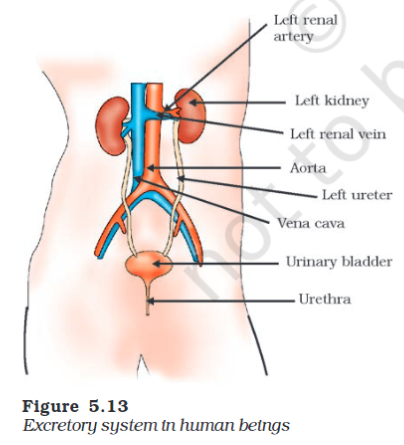

---
Alias:
tags: Study, 10th/Science/Bio/Ch5-Life-Processes
date: June 24, 2023
---
# Definition
The excretory system of humans comprises of:
- Pair of [[Kidney|Kidneys]]
- Pair of Ureters
- Urinary Bladder
- Urethra

It mostly removes nitrogenous wastes which come from **protein breakdown in the form of Urea.**
The waste products from the blood is filtered out and urine is produced.
## Types of Nitrogenous Wastes
- Ammonia (aquatic organisms, fishes)
- Uric Acids (Birds)
- Urea (Mammals)
Here, in terms of toxicity, ammonia > urea > uric acid
## The Process
- Blood goes to the kidneys through the **renal artery**
- **Glomerulus** filters the blood.
- **Bowman's Capsule** collects the filtered blood, sends it for reabsorption
- Substances like glucose, amino acids, water, etc. are reabsorbed in the tubule.
- Urine is formed and sent via collecting duct and ureters to the urinary bladder.
### Nutshell
- Glomerules Filtration - Glomerules
- Tubular Reabsorption - PCT, Henle's Loop, DCT
- Tubular Secretion

The amount of water re-absorbed depends on how much excess water there is in the body, and on how much of dissolved waste there is to be excreted.
## [[Hemodialysis]]

---
# Backlinks
[[Excretion]]

---
# Flashcards
Why is urine produced?;;The waste products from the blood is filtered out and urine is produced.
<!--SR:!2024-03-13,97,200-->

What does the excretory system in human consist of?
?
- Pair of Kidneys
- Pair of Ureters
- Urinary Bladder
- Urethra
<!--SR:!2024-09-18,316,280-->

What is the excretory process in the kidneys?
?
- Blood goes to the nephrons through the **renal artery**.
- **Glomerulus** filters the blood.
- **Bowman's Capsule** collects the filtered blood, sends it for reabsorption
- Substances like glucose, amino acids, water, etc. are reabsorbed in the tubule.
- Urine is formed and sent via collecting duct and ureters to the urinary bladder.
<!--SR:!2025-02-13,437,280-->

The amount of water reabsorbed depends on what?;;The amount of water re-absorbed depends on how much excess water there is in the body, and on how much of dissolved waste there is to be excreted.
<!--SR:!2024-06-23,180,240-->

---

%%
Dates: June 24, 2023, June 25, 2023
%%