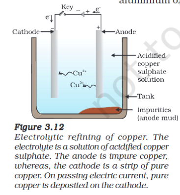

# Definition
The processes are different on the basis of reactivity of the metal.
**The higher the reactivity, the harder it is to separate the metal**
## Extraction
### Metals of low reactivity
- Usually found in Sulphide Ore.
- Heated in excess air (Roasting) to form metal oxide.
- This metal oxide is then reduced and refined.
### Metals of Medium Reactivity
- Found in both Sulphide and Carbonate Ores.
- Sulphide Ores -> Roasting
- Carbonate Ores are heated in limited air to form metal oxides.
### Metals of High Reactivity
- These are acquired by the electrolysis of the metal's molten chlorides.
- The metal deposits in Cathode and chlorine is liberated in the anode.
## Refining
The obtained metals are often impure. Those are refined using electrolysis.

---
# Backlinks
[[Occurence of Metals]]

---
# Flashcards

Extraction of ores in each reactivity
?
**Metals of low reactivity**
- Usually found in Sulphide Ore.
- Heated in excess air (Roasting) to form metal oxide.
- This metal oxide is then reduced and refined.
**Metals of Medium Reactivity**
- Found in both Sulphide and Carbonate Ores.
- Sulphide Ores -> Roasting
- Carbonate Ores are heated in limited air to form metal oxides.
**Metals of High Reactivity**
- These are acquired by the electrolysis of the metal's molten chlorides.
- The metal deposits in Cathode and chlorine is liberated in the anode.
---
<!--SR:!2024-06-05,124,260-->

%%
Dates: October 7, 2023
%%