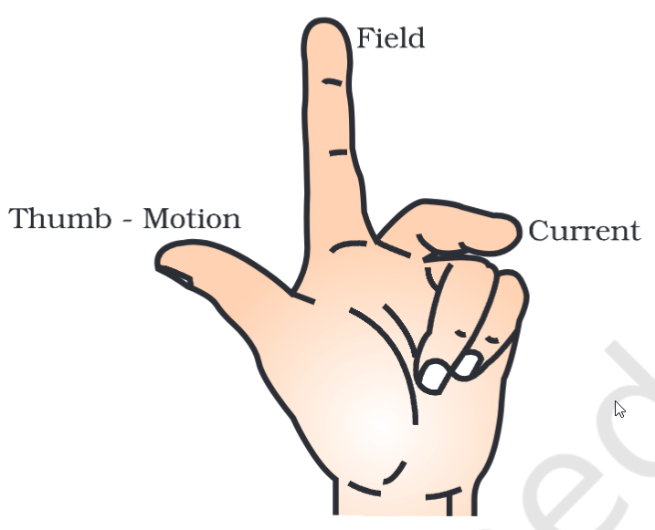

# Definition
Fleming's Left Rule helps us find the direction of Force, Current and or Magnetic Field based on the parameters.

## Memory Device
Thumb - Father - Force
Index Finger - Mother - Magnetic Field
Middle Finger - Child - Current

---
# Backlinks
[[Force on a CCC]]

---
# Flashcards

What is Fleming's Left hand rule?
?
Fleming's Left Rule helps us find the direction of Force, Current and or Magnetic Field based on the parameters.

<!--SR:!2024-05-05,105,280-->

---

%%
Dates: November 11, 2023
%%