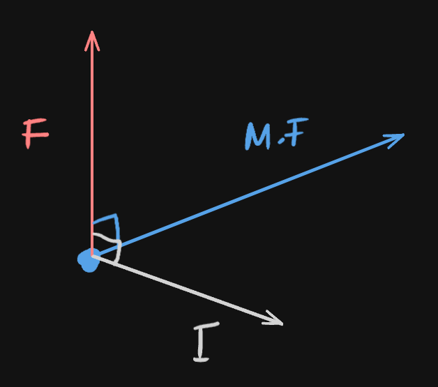
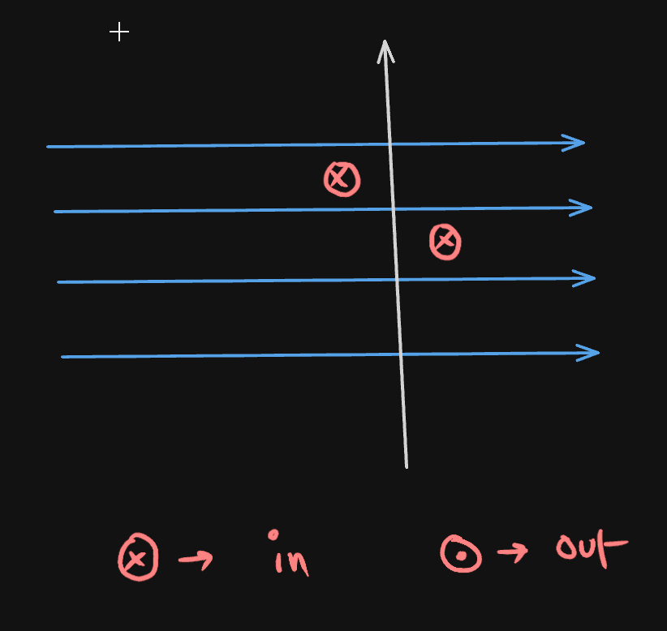

# Definition
The force from an external magnetic field is mutually perpendicular to both the magnetic field of a conductor and the direction of its current.

An example of force acting on a M.F and Current on a 2D plane

## [[Fleming's Left Hand Rule]]
## Direction of Current based on charge of particles (FLHR)
- Positive - current is the same direction of particle travelled
- Negative - current is opposite the direction of particle travelled
- No force acts on neutral particle / entity

---
# Backlinks
[[Magnetic Effect of Electric Current]]

---
# Flashcards

How does a force of an ext. Magnetic Field act on a conductor's M.F and Current?
?
The force from an external magnetic field is mutually perpendicular to both the magnetic field of a conductor and the direction of its current.
<!--SR:!2024-10-27,236,280-->

Direction of Current based on charge of particles in FLHR:
?
- Positive - current is the same direction of particle travelled
- Negative - current is opposite the direction of particle travelled
- No force acts on neutral particle / entity
<!--SR:!2024-03-30,78,264-->

---

%%
Dates: November 10, 2023
%%