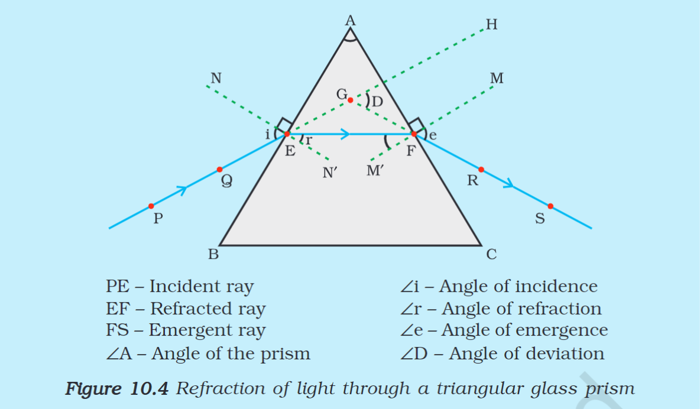
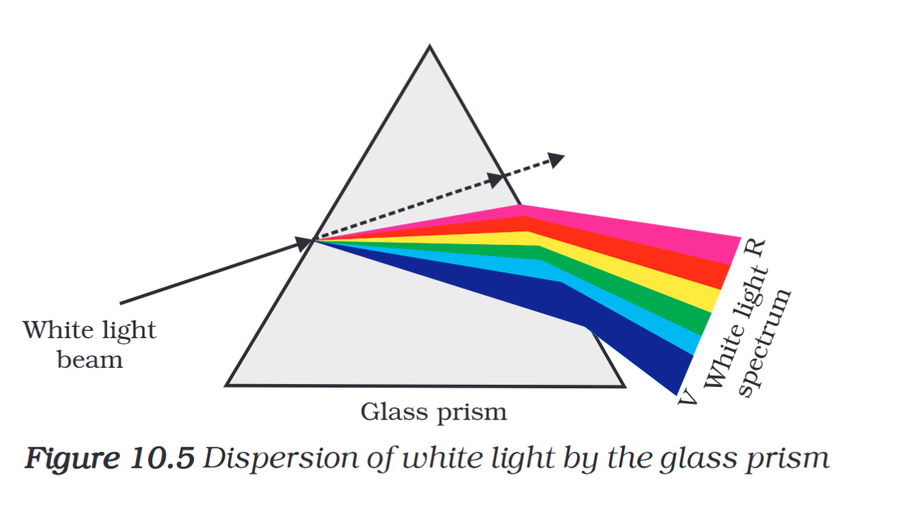
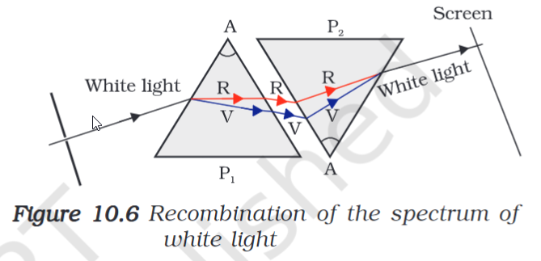
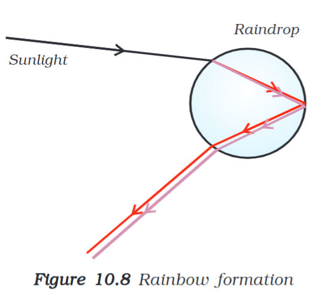

---
Alias:
tags: Study, 10th/Science/Physics/Ch10-Human-Eye
date: August 3, 2023
---
# Definition
## Refraction through Glass Prism

The emergent ray bends with an angle of direction of the incident ray. This is called the angle of deviation.
## Dispersion of White Light through a Glass Prism

*See you in the dark side of the moon...*

The white light is split into a band of colours called the **spectrum.** This splitting of a light into its colour components is called the dispersion of light. In the case of white light, the **red light refracts the least** (due to its longer wavelength) and the **blue light refracts the most** (due to its shorter wavelength).
## The spectrum of white light and its founding
Any light which has the spectrum of the sunlight is called the white light.
It was first discovered by Sir Isaac Newton when he combined two prisms side by side. The second emergent ray came out to be white. Thus it was proved that the sun had seven colors in it's light spectrum.

## Rainbow Formation
The formation of rainbow is a natural example of the spectrum. It occurs because of the dispersion of the light by the raindrops. The light is dispersed inside, then reflected and the refracted again.

---
# Backlinks
[[The Human Eye and The Colorful World|Phy Ch10]]

---
# Flashcards

What is the dispersion of light?
?
This splitting of a light into its colour components is called the dispersion of light.
<!--SR:!2024-03-24,149,282-->

What is a spectrum?
?
It is band of colors which are a component of light.
<!--SR:!2024-05-08,100,260-->

Any light which has the spectrum of the sunlight is called the {{white light}}.
<!--SR:!2025-04-03,439,282-->

Who found the spectrum of sunlight?;;Isaac Newton.
<!--SR:!2025-05-19,447,280-->

Explain Rainbow formation?
?
It occurs because of the dispersion of the light by the raindrops. The light is dispersed inside, then reflected and the refracted again.

<!--SR:!2024-09-19,273,242-->

---

%%
Dates: August 3, 2023
%%