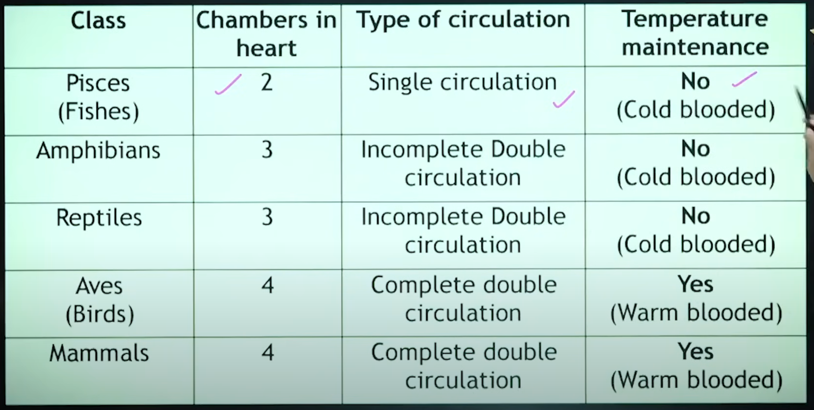
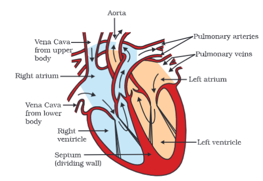
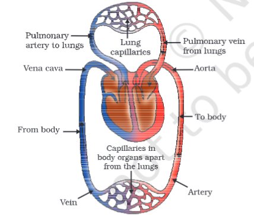
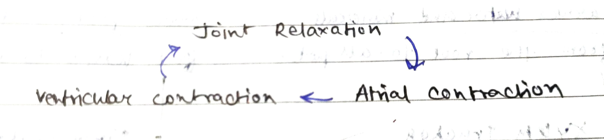

---
Alias:
tags: Study, 10th/Science/Bio/Ch5-Life-Processes
date: June 22, 2023
---
# Definition
Heart is the pumping organ of blood. It has four different chambers to separate oxygenated and de-oxygenated blood. **Why?** For efficient transportation. 
## Chambers in Heart
- 2 chambers - Mixing of blood (inefficient); present in aquatic organisms, fishes, etc.
- 3 chambers - Partial mixing; present in amphibians, reptiles
- 4 chambers - no mixing (most efficient, yet); present in mammals, birds, crocodile (exception from reptiles)

### Atria
The heart has two atria: Left and Right.
- Deoxygenated blood comes from body to the **Right Atrium** then goes to **Right Ventricle**.
- Oxygenated blood comes from lungs to the **Left Atrium** then goes to **Left Ventricle**.
### Ventricles
- Deoxygenated blood is passed though the **Pulmonary Artery** to the Lungs by the **Right Ventricle.**
- Oxygenated blood is passed through the **Aorta** to the body by the **Right Ventricle**.
- The walls of the ventricles are stronger, thicker than of the atria. **Why?** Because it needs uses more force to push the blood out.
### Valves

^36216f

- Valves ensure that the blood doesn't flow backward.

## The Process
Deoxygenated blood from body -> Vena Cava (superior and inferior) -> **Right Atrium** -> **Right Ventricle** -> Pulmonary Artery -> Lungs -> Pulmonary Vein -> **Left Atrium** -> **Left Ventricle** -> Aorta -> Body

## Double Circulation
The blood passes **twice** through the heart (once from body, once from lungs) in a single heartbeat.
## Cardiac Cycle
Sequence of events in a single heartbeat.

## Blood Pressure
Pressure of the blood in the arteries after pumping.
- Measured by sphygmomanometer. 
- Normal blood pressure: $$\frac{120\rightarrow\text{ Systolic BP}}{80\rightarrow\text{ Dystolic BP}}$$
- Systolic Pressure: Pressure in artery during contraction
- Diastolic Pressure: Pressure in artery during relaxation

---
# Backlinks
[[Transportation in Humans]]

---
# Flashcards

Why are the walls of the ventricles are stronger, thicker than of the atria?;;Because the ventricles use more force push blood.
<!--SR:!2024-05-01,227,280-->

What is the process of circulation in heart?
?
Deoxygenated blood from body -> Vena Cava (superior and inferior) -> **Right Atrium** -> **Right Ventricle** -> Pulmonary Artery -> Lungs -> Pulmonary Vein -> **Left Atrium** -> **Left Ventricle** -> Aorta -> Body
<!--SR:!2025-01-21,366,268-->

Why does the heart have four different chambers?;;To differentiate between oxygenated and deoxygenated blood
<!--SR:!2025-04-21,448,268-->

What is the use of valves in the heart?;;So that the blood doesn't flow backward.
<!--SR:!2024-03-21,197,288-->

What is double circulation?;;The blood passes **twice** through the heart (once from body, once from lungs) in a single heartbeat.
<!--SR:!2024-11-29,388,302-->

What is cardiac cycle
?
Sequence of events in a single heartbeat.

<!--SR:!2024-03-18,46,188-->

What is blood pressure?
?
Pressure of the blood in the arteries after pumping.
- Measured by sphygmomanometer.
- Normal blood pressure: $$\frac{120\rightarrow\text{ Systolic BP}}{80\rightarrow\text{ Dystolic BP}}$$
- Systolic Pressure: Pressure in artery during contraction.
- Diastolic Pressure: Pressure in artery during relaxation.
<!--SR:!2024-04-18,172,222-->

How is blood pressure measured?
?
Sphygmomanometer
<!--SR:!2025-03-13,463,300-->

---

%%
Dates: June 22, 2023
%%