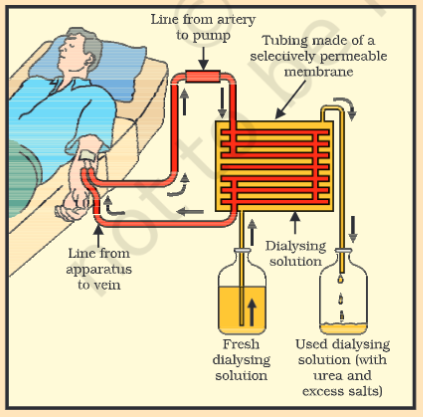

---
Alias:
tags: Study, 10th/Science/Bio/Ch5-Life-Processes
date: June 25, 2023
---
# Definition
Removal of toxins through the process of dialysis via an artificial kidney is called **hemodialysis.**
- There is no re-absorption involved here.
## The Process

The artificial kidney contains number of tubes with a semi-permeable membrane, suspended in a tank filled with dialysing liquid which has **the same osmotic pressure as blood.** Blood is passed onto those tubes. Through diffusion, waste products pass onto the fluid and removed. The clean blood is passed back to the patient.

---
# Backlinks
[[Excretory System in Humans]]

---
# Flashcards

What is hemodialysis?
?
Removal of toxins through the process of dialysis via an artificial kidney is called **hemodialysis.**
- There is no re-absorption involved here.
<!--SR:!2024-04-26,159,220-->

Explain the process of hemodialysis.
?
The artificial kidney contains number of tubes with a semi-permeable membrane, suspended in a tank filled with dialysing liquid which has **the same osmotic pressure as blood.** Blood is passed onto those tubes. Through diffusion, waste products pass onto the fluid and removed. The clean blood is passed back to the patient.
<!--SR:!2024-04-20,90,280-->

---

%%
Dates: June 25, 2023
%%