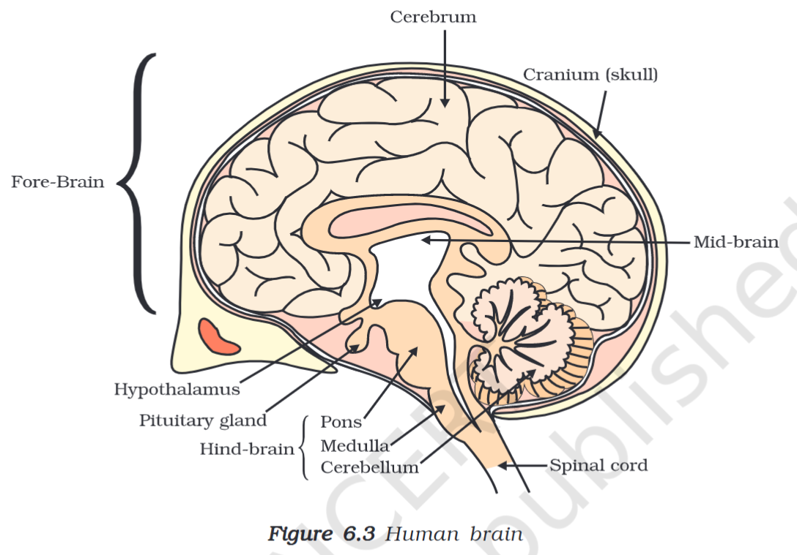

# Definition

The Human Brain has three parts, namely
## Forebrain
It contains
- [[Cerebrum]]
- [[Diencephelon]]
### Functions of the Forebrain
- Stores information (Memory)
- Thinking
- Controlling the vision, hunger and hearing
- Receives sensory information
- Controlling voluntary movements
## Midbrain
It forms a relationship between the #Forebrain and the #Hindbrain. Also controls the **reflex** of eyes and ears
## Hindbrain
It contains
- [[Pons]]
- [[Medulla Oblongata]]
- [[Cerebellum]]
## [[Spinal Cord]]
## Protection of Brain and Spinal Cord
- Brain - Protected by the Cranium and Cerebrospinal fluid
- Spinal Cord - Protected by the vertebral column.

---
# Backlinks
[[Control and Coordination|Bio Ch6]]

---
# Flashcards

What is the brain?
?
It is a part of the Central Nervous System. It is the main organ responsible for carrying out the decision making process.
<!--SR:!2024-06-08,162,240-->

What is the forebrain and its functions?
?
It contains
- [[Cerebrum]]
- [[Diencephelon]]
### Functions of the Forebrain
- Stores information (Memory)
- Thinking
- Controlling the vision, hunger and hearing
- Receives sensory information
- Controlling voluntary movements
<!--SR:!2024-04-02,107,224-->

What is the midbrain?
?
It forms a relationship between the #Forebrain and the #Hindbrain. Also controls the **reflex** of eyes and ears
<!--SR:!2024-06-27,162,220-->

What is the hindbrain?
?
- [[Pons]]
- [[Medulla Oblongata]]
- [[Cerebellum]]
<!--SR:!2024-06-27,217,280-->

How is the brain and spinal cord protected?
?
- Brain - Protected by the Cranium and Cerebrospinal fluid
- Spinal Cord - Protected by the vertebral column.
<!--SR:!2024-03-14,116,268-->

---

%%
Dates: August 25, 2023, August 27, 2023
%%