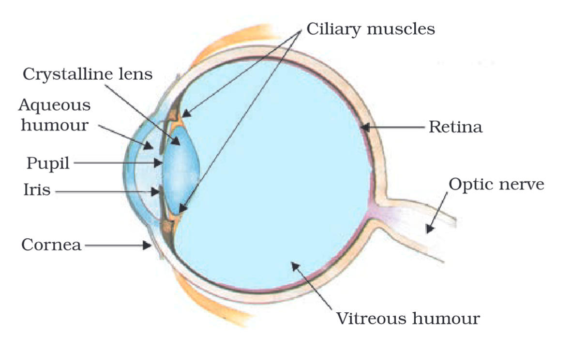

---
Alias:
tags: Study, 10th/Science/Physics/Ch10-Human-Eye
date: August 1, 2023
---
# Definition
The Human eye is a major organ of the body, forming one of the five (or six?) sense organs. It acts like a camera. **It works on the principle of refraction.**
## Parts of the human eye

### Cornea
It is a transparent membrane which lets light enter into the eye. Refraction happens here
### Iris and Pupil
Iris is a muscular diaphragm which contracts and relaxes to control the size of the pupil. The pupil controls the amount of light which may enter into the eye.
#### Mechanism
- More light -> Iris contracts -> Pupil gets smaller -> Less light gets into the eye
- Less light -> Iris relaxes -> Pupil gets bigger -> More light gets into the eye
### Crystalline Lens and Ciliary Muscles
This lens is made out of proteins. The ciliary muscles contract and relax to control the curvature of the lens to change the focal length.
### Retina
It is a screen where the lens forms an image in.
It contains two types of cells:
- Rods - sensitive to light (brightness)
- Cones - sensitive to colour (RGB)
### Aqueous and Vitreous Humour
Fluid in the eye.
## Working of the eye / How do we see an object?
The image formed by the lens on the retina is inverted. The light receptors in the retina send electrical signals (impulses?) through the optic nerve to the brain. The brain then processes the image and we can "see" the object.
## [[Power of Accommodation]]
## Why do we have two eyes?
**Because two eyes = more FOV.** Also we can a sense of depth with two eyes. With one eye, things seem two dimensional. But with two eyes, we get different images, and the brain processes to give us a 3D image with a sense of depth.
## Far and near points of the eye
Far point = infinity
Near point = 25cm

---
# Backlinks
[[The Human Eye and The Colorful World|Phy Ch10]]

---
# Flashcards

What are the parts of the human eye and what do they do?
?
### Cornea
It is a transparent membrane which lets light enter into the eye. Refraction happens here
### Iris and Pupil
Iris is a muscular diaphragm which contracts and relaxes to control the size of the pupil. The pupil controls the amount of light which may enter into the eye.
### Crystalline Lens and Ciliary Muscles
This lens is made out of proteins. The ciliary muscles contract and relax to control the curvature of the lens to change the focal length.
### Retina
It is a screen where the lens forms an image in.
### Aqueous and Vitreous Humour
Fluid in the eye.
<!--SR:!2025-02-28,379,260-->

The human eye works on the principle of {{refraction}}
<!--SR:!2025-06-11,461,280-->

How do we see an object? What is the working of an eye?
?
The image formed by the lens on the retina is inverted. The light receptors in the retina send electrical signals (impulses?) through the optic nerve to the brain. The brain then processes the image and we can "see" the object.
<!--SR:!2025-02-01,386,266-->

Why do we have two eyes?
?
**Because two eyes = more FOV.** Also we can a sense of depth with two eyes. With one eye, things seem two dimensional. But with two eyes, we get different images, and the brain processes to give us a 3D image with a sense of depth.
<!--SR:!2024-12-28,328,266-->

Far point = {{infinity}}
<!--SR:!2024-03-26,151,286-->

Near point = {{25cm}}
<!--SR:!2024-03-13,138,260-->

---

%%
Dates: August 1, 2023
%%