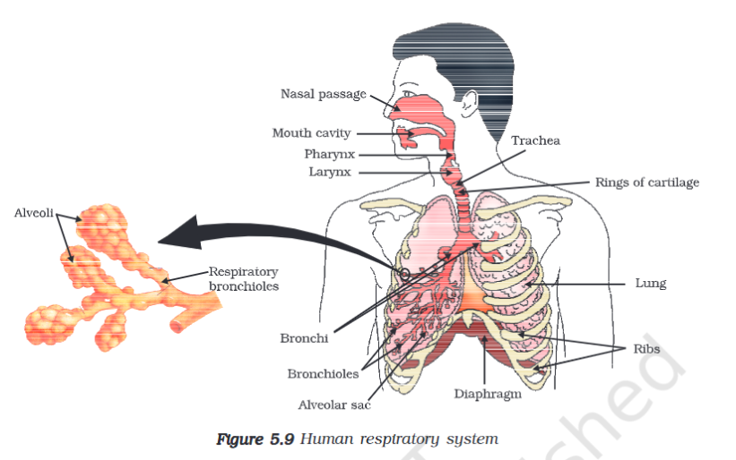
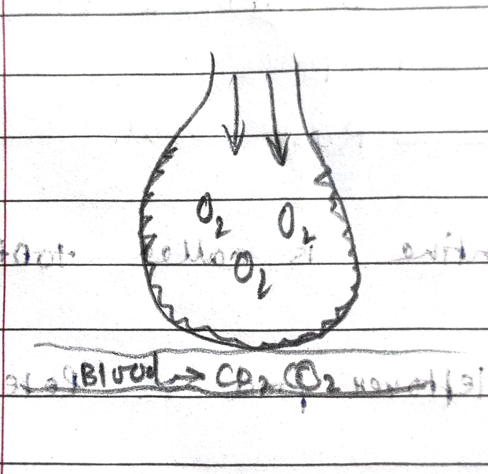

---
Alias:
tags: Study, 10th/Science/Bio/Ch5-Life-Processes
date: June 6, 2023
---
# Definition

## Steps in human respiration
Air -> Nostril -> Nasal Chamber -> Pharynx -> Trachea -> **Lungs** -> Primary Bronchus -> Secondary Bronchus -> Tertiary Bronchus -> Bronchioles -> [[Alveoli]]

## [[Diffusion and Blood]]
## Notes
- Cartilaginous rings are present in the throat to prevent collapse.
- Fine hair is present nasal chamber to capture dust and dirt.

---
# Backlinks
[[Aerobic Respiration]]

---
# Flashcards

What are the steps of Human Respiration?
?
Air -> Nostril -> Nasal Chamber -> Pharynx -> Trachea -> **Lungs** -> Primary Bronchus -> Secondary Bronchus -> Tertiary Bronchus -> Bronchioles -> Alveoli
<!--SR:!2024-04-15,93,200-->

Why are cartilaginous rings present in throat?;;Cartilaginous rings are present in the throat to prevent collapse.
<!--SR:!2025-04-15,487,298-->

Why are hair present in nasal chamber?;;Fine hair is present nasal chamber to capture dust and dirt.
<!--SR:!2024-05-16,239,278-->

---

%%
Dates: June 6, 2023
%%