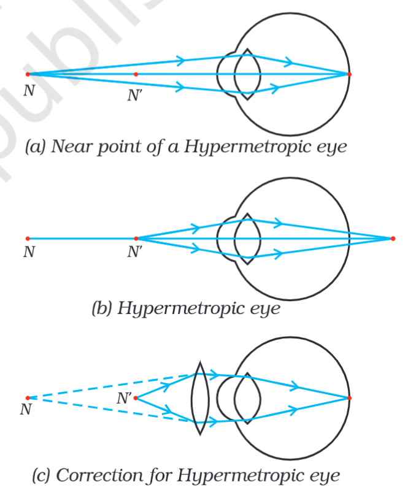

# Definition
The opposite of [[Myopia]]. This is the defect in which the person cannot see the nearby objects but can see the distant objects. **This happens because the image is formed beyond the retina**. This is because the near point is pushed away.

*where N' is the near point of the normal eye and N is the near point of the hypermetropic eye.*
## Causes
This defect can be caused due to:
- Decrease of the curvature of the lens
- Decrease in length of the eyeball
## Correction
Hypermetropic eye can be corrected using a **convex lens.**

---
# Backlinks
[[Defects of Vision]]

---
# Flashcards

What is Hypermetropia or Farsightedness?
?
This is the defect in which the person cannot see the nearby objects but can see the distant objects. **This happens because the image is formed beyond the retina**. This is because the near point is pushed away.
<!--SR:!2024-11-27,276,222-->

What causes hypermetropia?
?
This defect can be caused due to:
- Decrease of the curvature of the lens
- Decrease in length of the eyeball
<!--SR:!2024-06-12,130,280-->

Hypermetropic eye can be corrected using a {{convex lens}}
<!--SR:!2025-05-10,439,280-->

---

%%
Dates: August 1, 2023
%%