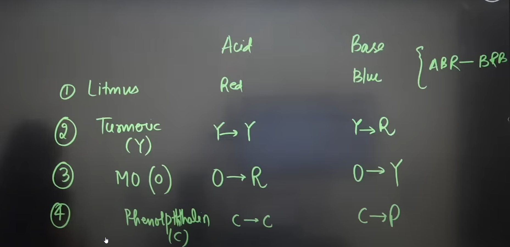
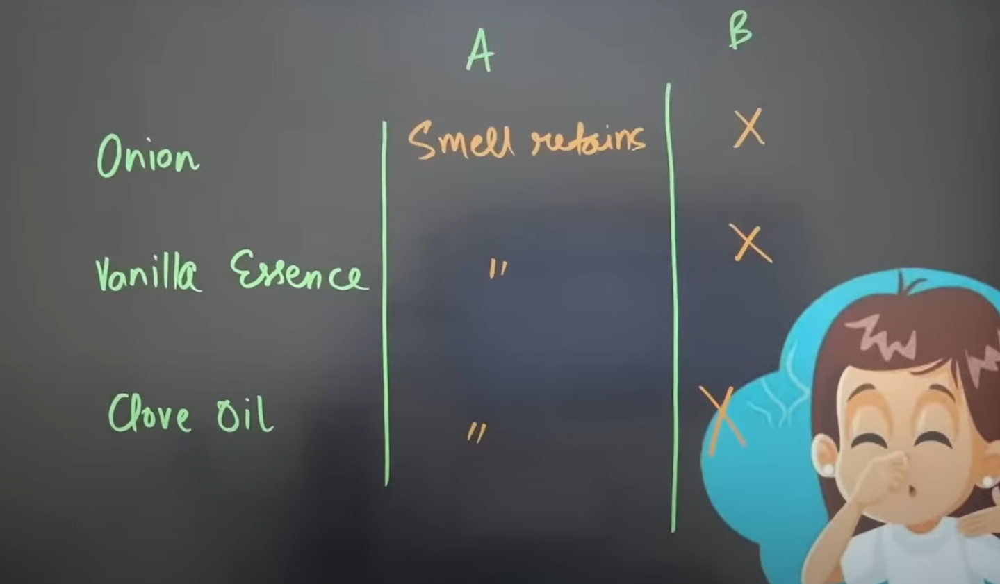

---
Alias:
tags: Study, 10th/Science/Chem/Ch2-Acids-Bases-Salts
date: August 4, 2023
---
# Definition
They indicate whether a substance is acidic, basic or neutral.
They can be either natural or synthetic.
## Acid-Base Indicators (Colour Changing)
They change colour when in contact with the appropriate substance.

```ad-note
Litmus Paper must be moistened before using.
```


## Olfactory Indicators (Smell Changing)
They change smell when in contact with appropriate substance

Bases remove the smell often.

---
# Backlinks
[[pH]]

---
# Flashcards

What are indicators?
?
They indicate whether a substance is acidic, basic or neutral.
They can be either natural or synthetic.
<!--SR:!2024-07-10,232,260-->

What are the types of indicators?
?
Based on origin, they can be **Natural or Synthetic.**
Based on characteristics, they can be **Colour changing or Olfactory.**
<!--SR:!2024-11-03,256,240-->

## Indicator Quiz
Acid turns {{Blue Litmus Red}}
<!--SR:!2024-06-02,192,260-->

Base Turns {{Red litmus Blue}}
<!--SR:!2024-08-15,254,280-->

The smell of clove oil, vanilla essence, and onion disappears in reaction with {{base}}.
<!--SR:!2024-08-04,156,180-->

Acid turns Turmeric {{Yellow}}
<!--SR:!2024-03-16,131,260-->

Base turns turmeric {{Red}}
<!--SR:!2024-08-14,261,280-->

Acid Turns Methyl Orange {{Red}}
<!--SR:!2024-03-11,26,260-->

Base turns Methyl Orange {{Yellow}}
<!--SR:!2024-10-15,232,260-->

Acid turns Phenolphthalein {{colorless}}
<!--SR:!2024-06-13,194,260-->

Base turns Phenolphthalein {{pink}}
<!--SR:!2024-04-02,148,266-->

---

%%
Dates: August 4, 2023, August 13, 2023, September 19, 2023
%%