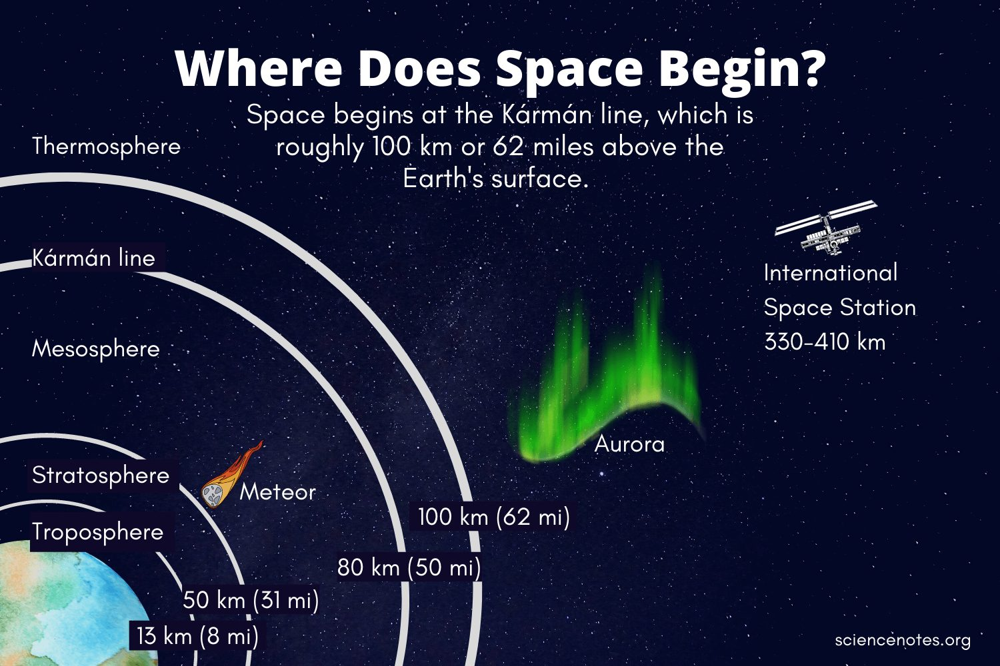

---
Alias:
tags: 10th/Science
date: June 11, 2023
---
# Definition
Karman Line is the beginning of the Outer Space. It was coined after Theodore van Karman.
**Karman line is situated 100km above the surface of earth**.

---
# Backlinks
Introduction to Space#Where does Space begin?

---
# Flashcards

---

%%
Dates: June 11, 2023
%%