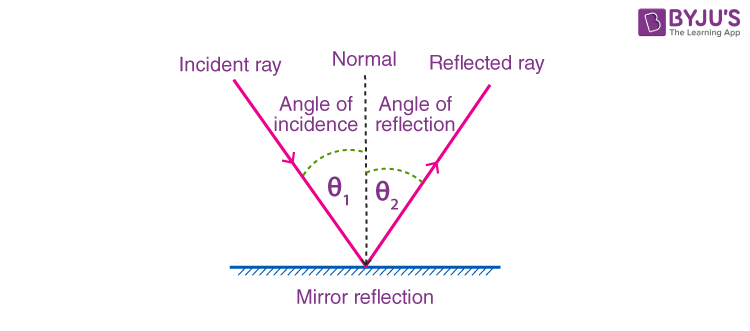

---
Alias:
tags: Study, 10th/Science/Physics/Ch9-Light
date: July 5, 2023
---
# Definition
- Angle of Incidence = Angle of Reflection
- The incident ray, reflected ray and normal all lie in the same plane.

---
# Backlinks
[[Reflection]]

---
# Flashcards

What are the laws of reflection?
?
- Angle of Incidence = Angle of Reflection
- The incident ray, reflected ray and normal all lie in the same plane.

<!--SR:!2025-08-23,572,300-->

---

%%
Dates: July 5, 2023
%%