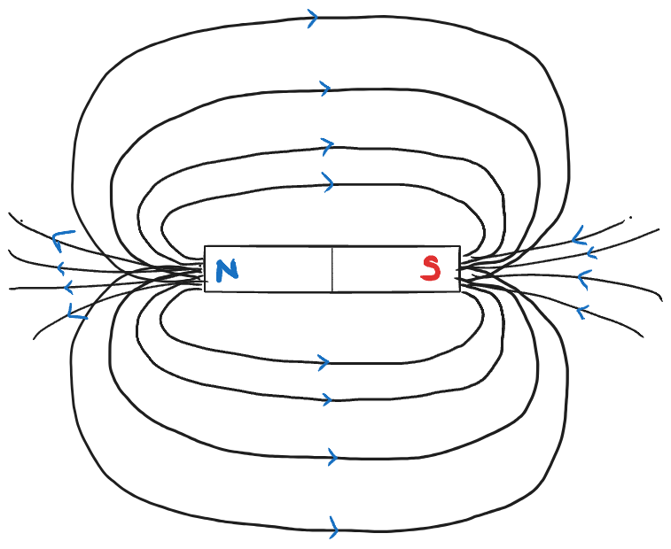
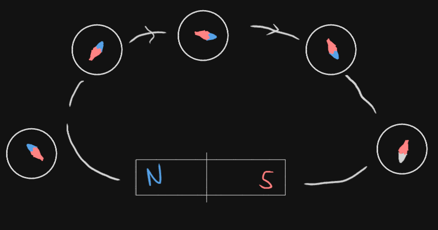

# Definition
Magnetic Field is the range of the magnet in which it attracts magnetic particles. It has a magnitude and direction (Vector Quantity). The SI Unit of M.F (B) is Tesla.

*M.F. of a bar magnet*
## Direction of Magnetic Field
The concept of magnetic field came when compasses were aligned alongside a magnet,

from which we could deduce that, **at any point, magnetic field will have only one direction.** It is a vector quantity, and it **cannot intersect.**  
### Pole to Pole directions
On the outside: North Pole > South Pole
On the inside: South pole > North Pole
## Field Lines
Field lines are used to **represent** a Magnetic Field. 
They can be used to visualise:
1. The strength of the M.F.
2. The direction of the M.F.
### Strength and Distance
It is known that **the more the distance, the weaker the M.F**, thus, fewer lines will represent the area of weaker strength.
Also, we could conclude that, 
$$\frac{1}{d} \propto \text{Magnitude}$$

---
# Backlinks
[[Magnetic Effect of Electric Current]]

---
# Flashcards

What is a Magnetic Field?
?
Magnetic Field is the range of the magnet in which it attracts magnetic particles. It has a magnitude and direction (Vector Quantity).
<!--SR:!2024-04-13,67,233-->

At any point, magnetic field will have only {{one}} direction.
<!--SR:!2024-05-13,118,285-->

Which direction (p2p) does a M.F. go in a magnet?
?
On the outside: North Pole > South Pole
On the inside: South pole > North Pole
<!--SR:!2024-03-18,71,265-->

What are field lines?
?
Field lines are used to **represent** a Magnetic Field.
They can be used to visualise:
1. The strength of the M.F.
2. The direction of the M.F.
<!--SR:!2024-05-14,97,260-->

The {{more}} the distance, the {{weaker}} the M.F.
<!--SR:!2024-05-02,111,287!2024-06-25,144,293-->

The SI Unit of M.F is {{Tesla}}
<!--SR:!2024-04-05,94,282-->

---

%%
Dates: November 8, 2023
%%