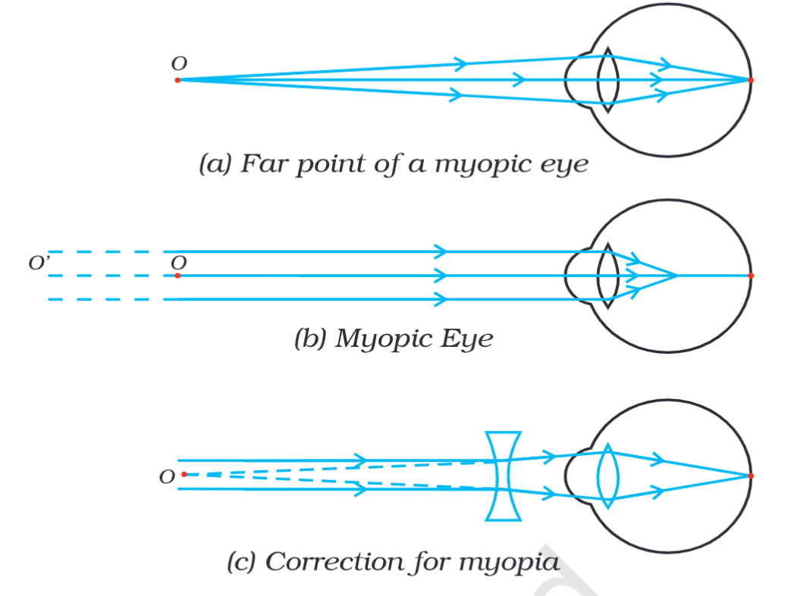

# Definition
Myopia is also known as near-sightedness. This is when a person cannot see the distant objects but can see the nearby objects. **This happens because the image is formed in front of the retina.** The far point gets pushed near.

*where O' is the far point of normal eye and O is the far point of the myopic eye.*
## Causes
This defect can be caused by:
- increased curvature of the lens
- increased length of the eyeball
## Correction
A myopic eye can be corrected using a concave lens.

---
# Backlinks
[[Defects of Vision]]

---
# Flashcards

What is Myopia or Nearsightedness? Why does it happen?
?
Myopia is also known as near-sightedness. This is when a person cannot see the distant objects but can see the nearby objects. **This happens because the image is formed in front of the retina.** The far point gets pushed near.
<!--SR:!2024-04-15,140,222-->

What are the causes of myopia?
?
This defect can be caused by:
- increased curvature of the lens
- increased length of the eyeball
<!--SR:!2025-03-22,429,280-->

A myopic eye can be corrected using a {{concave lens}}.
<!--SR:!2025-06-07,458,280-->

---

%%
Dates: August 1, 2023
%%