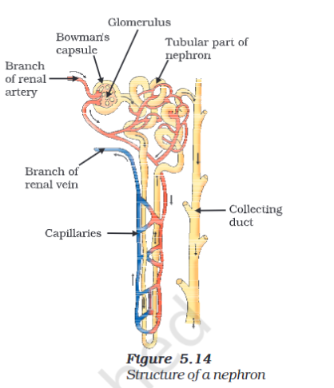

---
Alias:
tags: Study, 10th/Science/Bio/Ch5-Life-Processes
date: June 25, 2023
---
# Definition
## Structure of a Nephron

## The Process
Blood - via renal artery > Glomerulus -> Bowman's Capsule -> Tubule -> Collecting Duct -> Ureters -> Urinary Bladder.

- Glomerules acts like a sieve, where particles in the blood are filtered, smaller particles goes through it and reabsorbed if important.
- Tubules contain three parts; **Proximal Convoluted Tubule**, **Henle's Loop** and **Distal Convoluted Tubule**.
- Reabsorption of substances depends on **pH, osmotic pressure and equilibrium**.

---
# Backlinks
[[Kidney]]

---
# Flashcards
Which part of the nephron actually filters the blood?;;Glomerules acts like a sieve, where particles in the blood are filtered, smaller particles goes through it and reabsorbed if important.
<!--SR:!2024-09-01,312,280-->

Where does reabsorption occur in nephrons?;;In the Tubular Part.
<!--SR:!2024-04-28,192,260-->

---

%%
Dates: June 25, 2023
%%