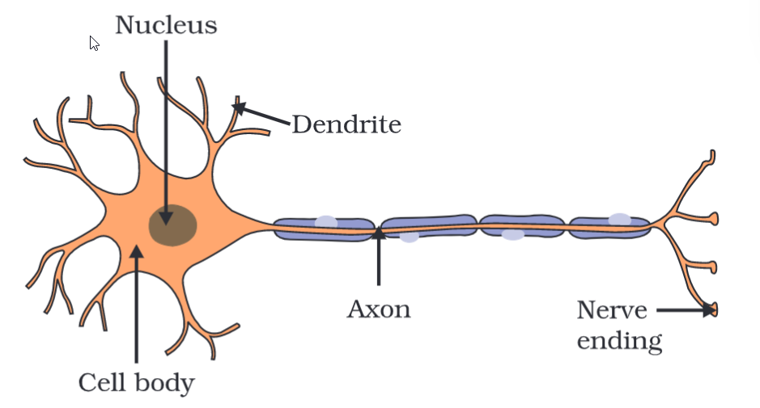

# Definition
The nervous system contains the following:

## Neurons
Neurons are the nerve cells which transmit electrical impulses. These cannot be divided nor repaired.

### Types of Neurons
- Sensory Neuron - These take the information from the #Receptors to the spinal cord / brain.
- Motor Neuron - These take the information from the spinal cord / brain to the effectors.
- Relay Neuron - This connects the other types of neurons in the spinal cord.
### Receptors
These specialised tips of neurons help in detecting and sensing stimuli. These are of multiple types
- Photo-receptors - light
- Phono-receptors - sound
- Thermo-receptors - heat
- Gustatory-receptors - taste
- Olfactory-receptors - smell
These are often present in our sense organs.
## Working of a Neuron
- The information is acquired at the dendrites
- Electrical impulse is generated in the cell body.
- The impulse travels through the axon to the nerve ending
- A chemical reaction takes place, and the synaptic vesicles release neurotransmitter
- The neurotransmitter crosses the synapse to the post synaptic neuron.
### Synapse
It is the gap between two neurons. This gap provides way for the neurotransmitter to transmit information between neurons and muscle cells.
## [[Reflex Action]]

---
# Backlinks
[[Control and Coordination|Bio Ch6]]

---
# Flashcards

What are neurons?
?
Neurons are the nerve cells which transmit electrical impulses. These cannot be divided nor repaired.
<!--SR:!2024-04-16,122,220-->

What are types of neurons?
?
- Sensory Neuron - These take the information from the #Receptors to the spinal cord / brain.
- Motor Neuron - These take the information from the spinal cord / brain to the effectors.
- Relay Neuron - This connects the other types of neurons in the spinal cord.
<!--SR:!2025-01-27,341,280-->

What are receptors and their types?
?
These specialised tips of neurons help in detecting and sensing stimuli. These are of multiple types
- Photo-receptors - light
- Phono-receptors - sound
- Thermo-receptors - heat
- Gustatory-receptors - taste
- Olfactory-receptors - smell
These are often present in our sense organs.
<!--SR:!2024-03-28,93,240-->

What is the working of a neuron? How does it transmit information?
- The information is acquired at the dendrites
- Electrical impulse is generated in the cell body.
- The impulse travels through the axon to the nerve ending
- A chemical reaction takes place, and the synaptic vesicles release neurotransmitter
- The neurotransmitter crosses the synapse to the post synaptic neuron.

What is a synapse?
?
It is the gap between two neurons. This gap provides way for the neurotransmitter to transmit information between neurons and muscle cells.
<!--SR:!2024-08-09,202,240-->

---

%%
Dates: August 25, 2023
%%