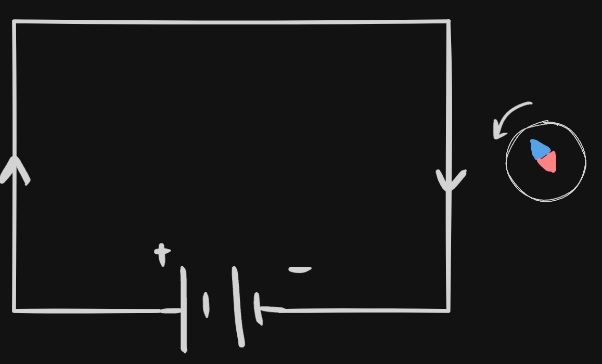

# Definition
## Properties of Charge
[[Electric Charge|Charge]] produces two effects: [[Heating Effect of Electric Current|Heating Effect]] and then [[Magnetic Effect of Electric Current|Magnetic Effect]].
This was discovered by **Hans Oersted**
## Oersted's Experiment
He placed a compass alongside a current carrying conductor,

And saw it **deflect,** providing evidence, that current does have a magnetic effect and forms a [[Magnetic Field and Field Lines|magnetic field]].

---
# Backlinks
[[Heating Effect of Electric Current]]

---
# Flashcards

Charge produces {{Heating and Magnetic}} Effects
<!--SR:!2024-08-21,177,280-->

---

%%
Dates: November 8, 2023
%%