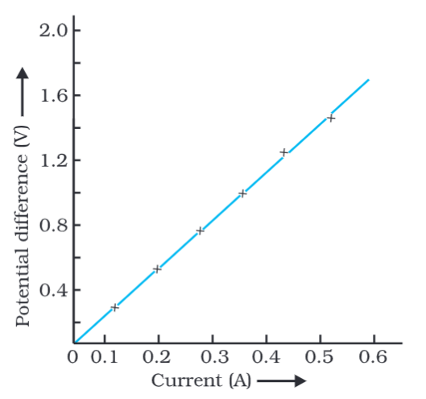

# Definition
Ohm's Law states that the [[Potential Difference]] is directly proportional to the [[Electric Current]], as long as the temperature remains the same.
## Formula
$$
V \propto I
$$
$$
V = IR
$$
where R is the [[Resistance]] of the conductor.
### More Formulae
$$
R = \frac{V}{I}
$$
$$
I = \frac{V}{R}
$$
## VI Graph

---
# Backlinks
[[Resistance]]

---
# Flashcards

What is the Ohm's Law?
?
Ohm's Law states that the [[Potential Difference]] is directly proportional to the [[Electric Current]], as long as the temperature remains the same.
$
V = IR
$
where R is the [[Resistance]] of the conductor.
<!--SR:!2024-11-25,279,280-->

---

%%
Dates: September 9, 2023
%%