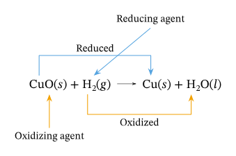

# Definition

The reactions where one substance is oxidised and one substance is reduced are called **Oxidation-Reduction Reactions** or **Redox Reactions**.

## Oxidation
When an object gains Oxygen or loses Hydrogen, it is said to be oxidised.
## Reduction
When an object loses Oxygen or gains Hydrogen, it is said to be reduced.
## Examples
- Copper Oxide is reduced and Hydrogen is oxidised.
	- $\ce{CuO + H2 -> Cu + H2O}$
- Zinc Oxide is reduced and Carbon is Oxidised.
	- $\ce{ZnO + C -> Zn + CO}$

---
# Backlinks

[[Types of Chemical Reactions]]

---
# Flashcards

What are Oxidation-Reduction or Redox Reactions?
?
The reactions where one substance is oxidised and one substance is reduced are called **Oxidation-Reduction Reactions** or **Redox Reactions**.
<!--SR:!2024-05-14,231,245-->

What is reduction?;;When a substance loses Oxygen or gains Hydrogen, it is said to be reduced.
<!--SR:!2024-11-04,355,260-->
What is oxidation?;;When a substance gains Oxygen or loses Hydrogen, it is said to be oxidised.
<!--SR:!2024-06-24,245,265-->

What are some examples of Redox Reactions?
?
- Copper Oxide is reduced and Hydrogen is oxidised.
	- $\ce{CuO + H2 -> Cu + H2O}$
- Zinc Oxide is reduced and Carbon is Oxidised.
	- $\ce{ZnO + C -> Zn + CO}$
<!--SR:!2024-04-23,155,205-->

Copper Oxide is reduced and Hydrogen is oxidised.;;;$\ce{CuO + H2 -> Cu + H2O}$
<!--SR:!2025-02-12,440,285!2025-05-12,536,285-->
Zinc Oxide is reduced and Carbon is Oxidised.;;;$\ce{ZnO + C -> Zn + CO}$
<!--SR:!2026-04-30,820,302!2025-11-10,685,305-->

---

%%
Dates: April 8, 2023, April 12, 2023
%%