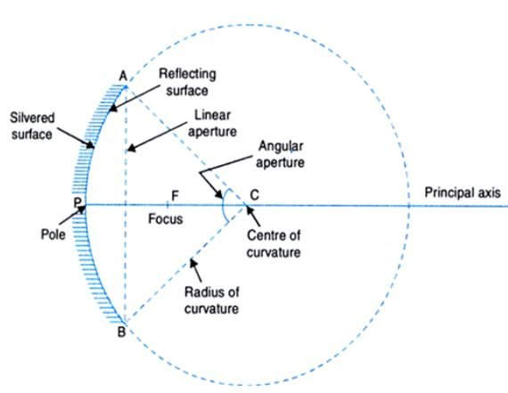

---
Alias:
tags: Study, 10th/Science/Physics/Ch9-Light
date: July 5, 2023
---
# Definition
A spherical mirror is a part of a sphere.

## Radius and Focus
The relation between focus is that,
$$
R = 2F \rightarrow F = R/2
$$
Thus, the focal length **FP** is half of the radius **PC**

---
# Backlinks
[[Spherical Mirrors]]

---
# Flashcards

What are the parts of a spherical mirror?
?
- Pole
- Centre of Curvature
- Focus
- Aperture
- Principal Axis

<!--SR:!2024-07-24,206,244-->

What is the principal axis?;;The line passing through the pole and centre of curvature is called the principal axis.
<!--SR:!2025-01-07,385,280-->

---

%%
Dates: July 5, 2023
%%