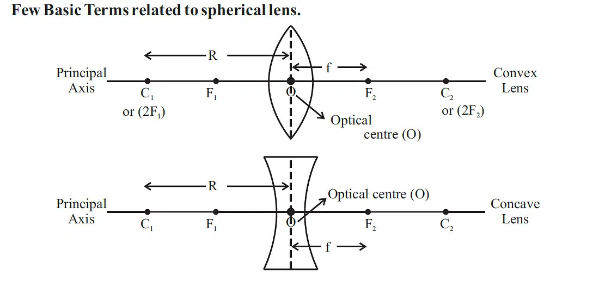

---
Alias:
tags: Study, 10th/Science/Physics/Ch9-Light
date: July 7, 2023
---
# Definition
A Spherical lens are made up of two imaginary spheres.

The relation of radius and focus apply here too.

---
# Backlinks
[[Spherical Lenses]]

---
# Flashcards

What are the parts of a spherical lens?
?
- Pole
- Centre of Curvature (2F)
- Focus
- Principal Axis
- Optical Centre and Optical Axis

<!--SR:!2025-06-10,476,240-->

---

%%
Dates: July 7, 2023
%%