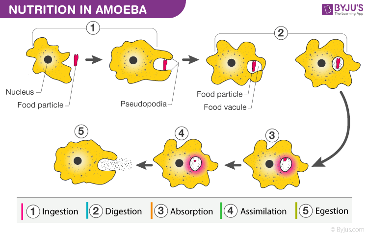

# Definition
Phagocytosis is the process through which organisms engulf food particles through its plasma membrane. It is a type of endocytosis.
## Process (in Amoeba)
1. The food particle is recognized
2. Pseudopodia is formed.
3. The particle is ingested by the pseudopodia.
4. The food is absorbed.
## Example:
- Nutrition in Amoeba
	- 

---
# Backlinks

[[Holozoic Nutrition]]

---
# Flashcards

What is phagocytosis?
?
Phagocytosis is the process through which organisms engulf food sources through its plasma membrane. It is a type of endocytosis and [[Holozoic Nutrition]].
<!--SR:!2024-03-25,50,260-->

---

%%
Dates: April 23, 2023
%%