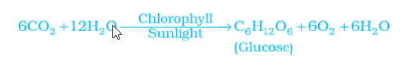

---
Alias:
tags: Study, 10th/Science/Bio/Ch5-Life-Processes
date: April 20, 2023
---
# Definition
It is the process by which autotrophs take in substances from outside and convert them and store it in form of energy. The raw material is $\ce{CO2}$ and $\ce{H2O}$ which are converted to Carbohydrates in presence of sunlight and chlorophyll.
In a nutshell, **it is the conversion of light energy and carbon dioxide and water into chemical energy.**

## [[Process of Photosynthesis]]

---
# Backlinks

[[Autotrophic Nutrition]]

---
# Flashcards

What is photosynthesis?
?
In a nutshell, **it is the conversion of light energy and carbon dioxide and water into chemical energy.**
<!--SR:!2024-06-27,214,222-->

What are the raw materials of photosynthesis?
?
Carbon Dioxide and Water in presence of sunlight.
<!--SR:!2024-04-25,212,262-->

Which pigment is needed for photosynthesis?;;Chlorophyll
<!--SR:!2024-06-26,280,280-->

---

%%
Dates: April 20, 2023, July 26, 2023
%%