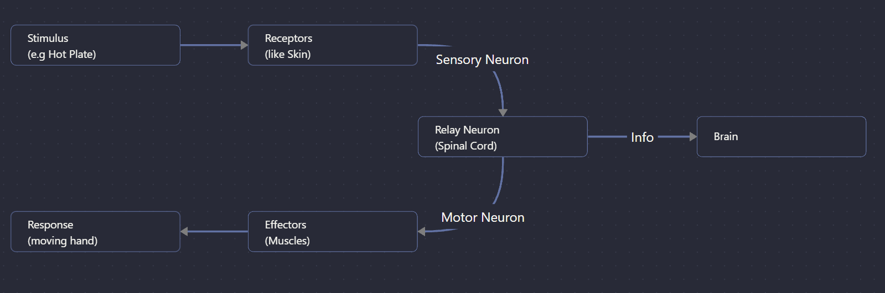

---
Alias:
tags: Study, 10th/Science/Bio/Ch6-Control-and-Coordination
date: August 25, 2023
---
# Definition
A reflex action is done without a thought process. There is no decision from the brain involved. It is done to reduce the time and protect us from harmful situations (stimuli).
Reflex Arc

---
# Backlinks
[[Nervous System]]

---
# Flashcards

What is reflex action?
?
A reflex action is done without a thought process. There is no decision from the brain involved. It is done to reduce the time and protect us from harmful situations (stimuli).
<!--SR:!2024-03-18,109,240-->

What is a reflex arc?
?

<!--SR:!2025-01-19,352,280-->

---

%%
Dates: August 25, 2023
%%