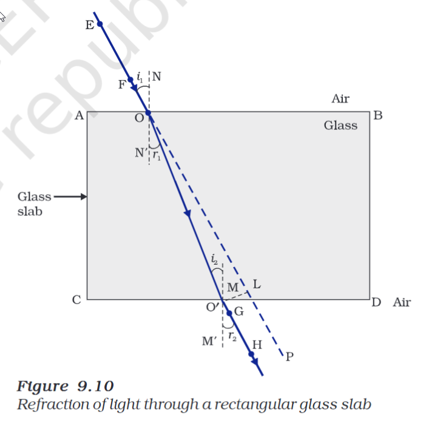

---
Alias:
tags: Study, 10th/Science/Physics/Ch9-Light
date: July 6, 2023
---
# Definition
It is the movement of light from one medium to another with different [[Optical Density]] **obliquely**. The direction of light changes. This is called refraction of light.
The speed of light changes as it enters the second medium, thus it causes refraction of light.
## Refraction through rectangular glass slab

- If the light ray moves from a rarer to denser medium, the ray will bend towards the normal and vice versa.
- Emergent ray is parallel to the incident ray.
	- **Why?** Because the extent of bending of ray of light at the interfaces are equal and opposite.
## [[Laws of Refraction]]
## [[Refractive Index]]

---
# Backlinks
[[Light - Reflection and Refraction]]

---
# Flashcards

What is refraction?
?
It is the movement of light from one medium to another with different [[Optical Density]] **obliquely**. Due to the change in the speed of light, the direction of light changes. This is called refraction of light.
<!--SR:!2024-04-23,66,182-->

Emergent ray is {{parallel}} to the {{incident ray}}.
<!--SR:!2024-12-24,341,280!2024-04-07,200,262-->

---

%%
Dates: July 6, 2023
%%