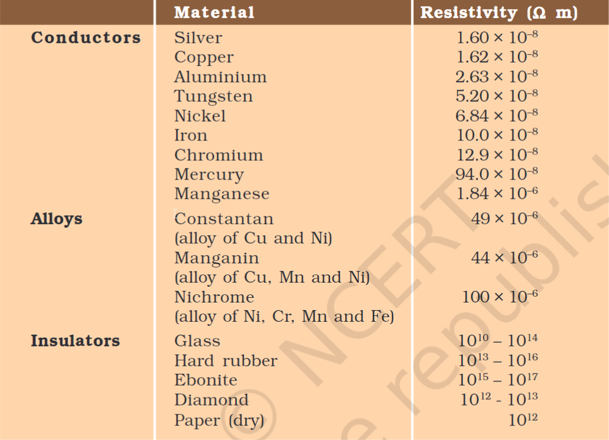

# Definition
The resistivity of the conductor is independent of length or area or cross-section but dependent on the material and temperature.
- **Every material has a different resistivity**
- It is denoted by $\rho$ (rho)
## SI Unit
From [[Ohm's Law]],
$$
\rho =  \frac{RA}{l}
$$
Thus SI Unit of Resistivity is $\ohm \text{ m}$ (Ohm Meters)
## Table of resistivity

---
# Backlinks
[[Resistance]]

---
# Flashcards

What is the resistivity of a conductor?
?
The resistivity of the conductor is independent of length or area or cross-section but dependent on the material and temperature.
- **Every material has a different resistivity**
- It is denoted by $\rho$ (rho)
<!--SR:!2024-04-12,85,260-->

SI Unit of Resistivity is {{$\ohm \text{ m}$ (Ohm Meters)}}
<!--SR:!2025-01-15,319,280-->

---

%%
Dates: September 9, 2023
%%